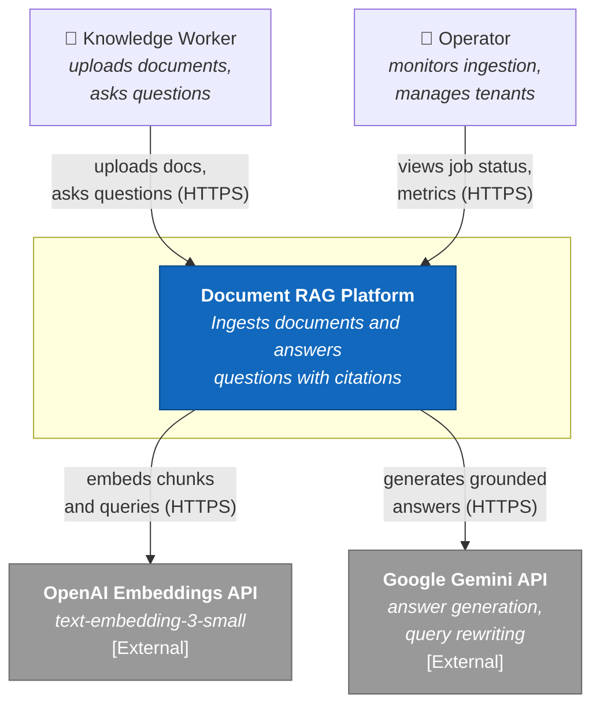
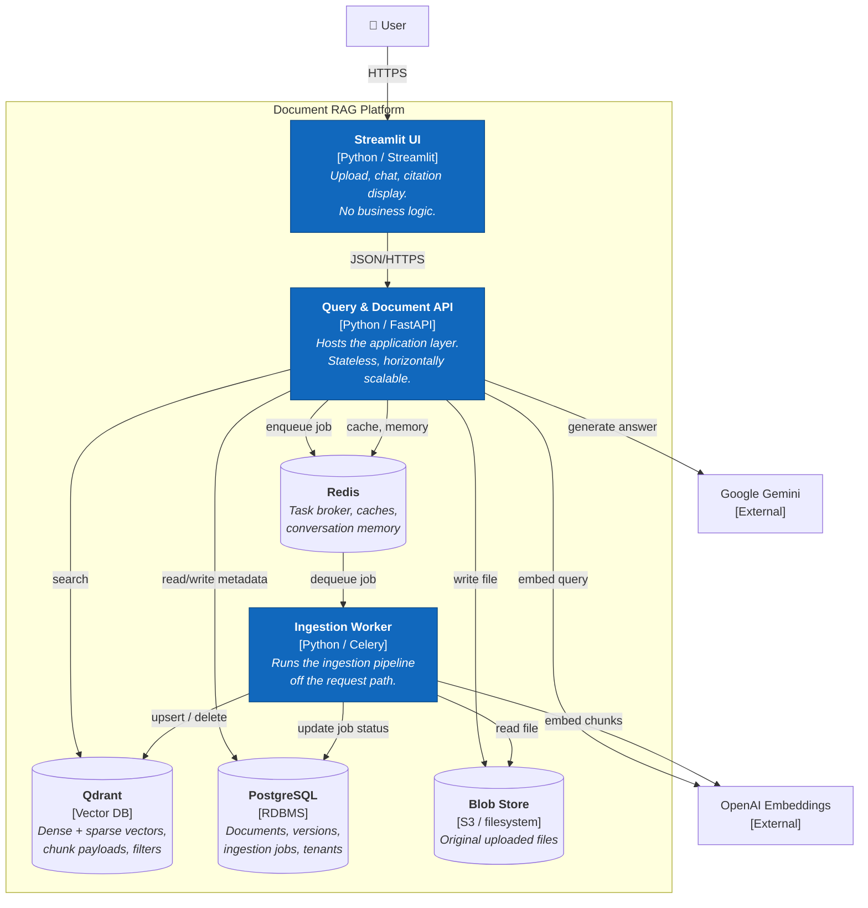
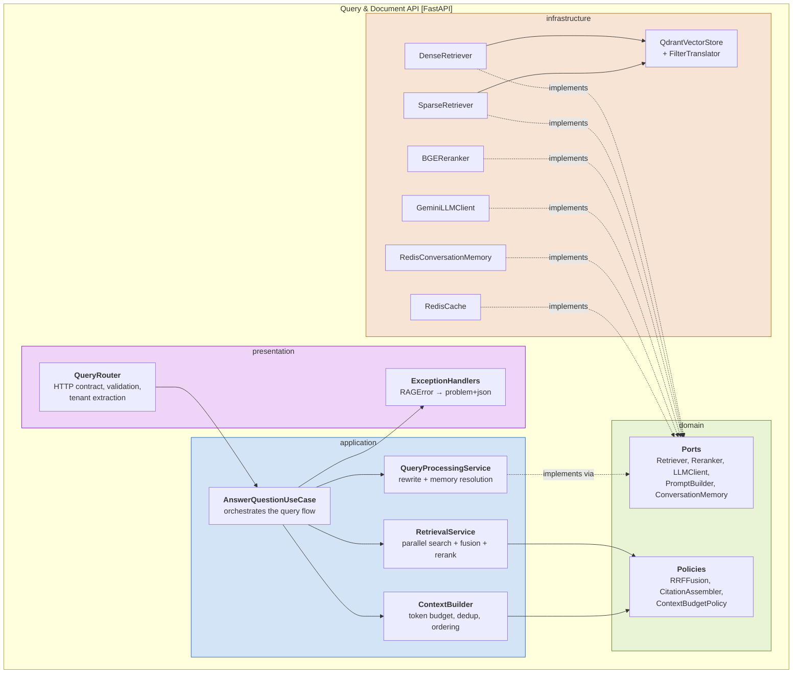
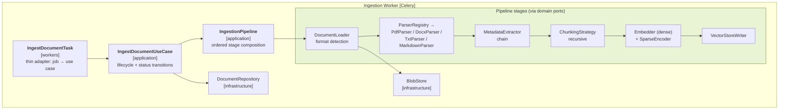
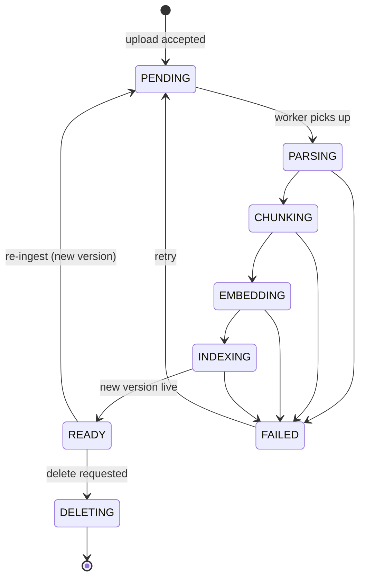
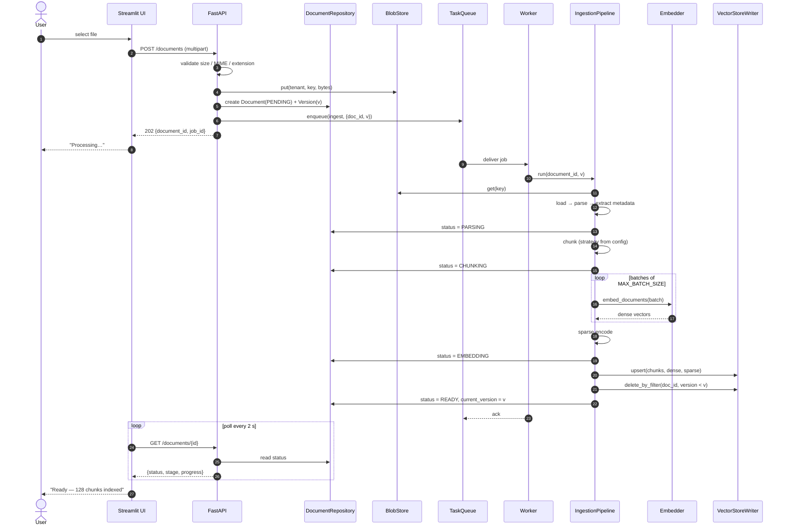
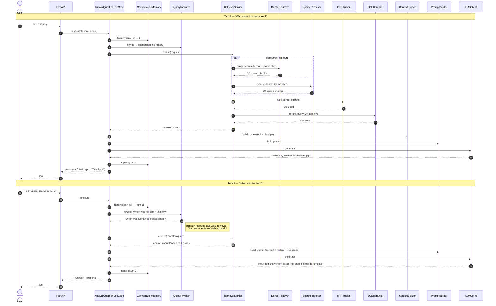
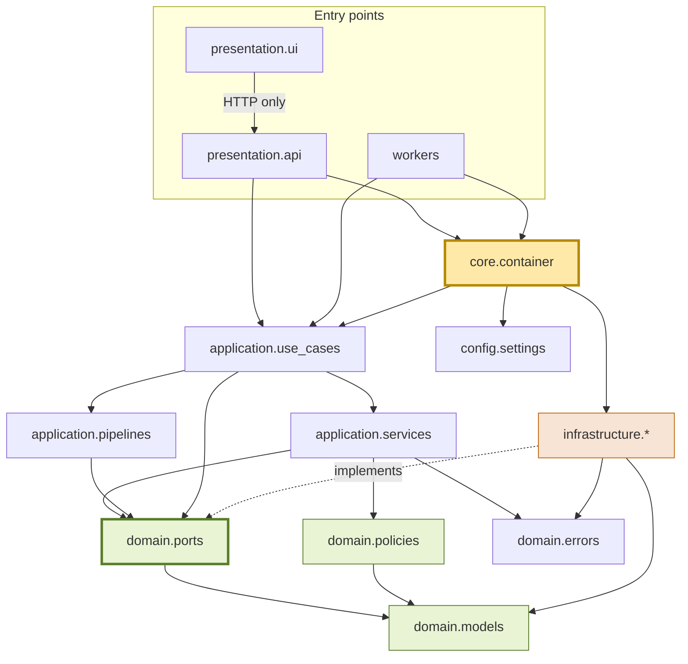

# Document RAG Platform — Architecture Specification

**Status:** Approved for planning
**Date:** 2026-07-27
**Supersedes:** the `QAWithPDF` prototype
**Scope:** Document Question Answering (PDF, DOCX, TXT, Markdown) with cited answers

---

## Table of Contents

1. [Scope and Non-Goals](#1-scope-and-non-goals)
2. [Current State Assessment](#2-current-state-assessment)
3. [Architectural Principles](#3-architectural-principles)
4. [The Dependency Rule](#4-the-dependency-rule)
5. [C4 Diagrams](#5-c4-diagrams)
6. [Complete Folder Structure](#6-complete-folder-structure)
7. [Folder Responsibilities](#7-folder-responsibilities)
8. [Domain Model](#8-domain-model)
9. [Port Contracts](#9-port-contracts)
10. [Adapter Mapping](#10-adapter-mapping)
11. [Module and Class Responsibilities](#11-module-and-class-responsibilities)
12. [System Data Flow](#12-system-data-flow)
13. [Sequence Diagrams](#13-sequence-diagrams)
14. [Dependency Graph](#14-dependency-graph)
15. [Extension Points](#15-extension-points)
16. [Cross-Cutting Concerns](#16-cross-cutting-concerns)
17. [Testing Architecture](#17-testing-architecture)
18. [Architecture Decision Records](#18-architecture-decision-records)
19. [Migration Strategy](#19-migration-strategy)
20. [Implementation Roadmap](#20-implementation-roadmap)
21. [Future Improvements](#21-future-improvements)
22. [Risk Register](#22-risk-register)

---

## 1. Scope and Non-Goals

### 1.1 In Scope

A multi-tenant document question-answering platform. Users upload documents; the system ingests them asynchronously; users ask natural-language questions and receive answers grounded in those documents, with citations back to the source location.

Supported formats: **PDF, DOCX, TXT, Markdown**.

Core capability chain: `ingestion → hybrid retrieval → reranking → LLM → cited answer`.

### 1.2 Explicit Non-Goals

The following are **out of scope by decision**, not by omission. Any proposal to add them requires a new ADR:

| Excluded | Reason |
|---|---|
| SQL / database question answering | Different retrieval paradigm; would fracture the retrieval abstraction |
| Agentic loops, tool-using agents | Adds non-determinism and cost variance to a system whose value is grounded accuracy |
| OCR, scanned-document pipelines | Requires image processing and a quality-assurance layer of its own |
| Image understanding, multimodal RAG | The chunk model is text-only by design |
| Web search integration | Answers must be attributable to uploaded documents only |
| Fine-tuning, model training | Provider models are treated as replaceable commodities |

The architecture does not *prevent* these later — but nothing is designed in anticipation of them (YAGNI).

### 1.3 Quality Attributes (ranked)

Ranking matters: when two attributes conflict, the higher one wins.

1. **Correctness of attribution** — an answer that cannot be traced to a chunk is a defect.
2. **Replaceability** — any provider or algorithm swaps without touching `domain` or `application`.
3. **Testability** — every component testable without network access.
4. **Observability** — every stage emits timing and outcome.
5. **Latency** — p95 query under 5 s with rerank enabled.
6. **Throughput / scale** — target 10k documents, ~2M chunks, tens of concurrent users.

---

## 2. Current State Assessment

### 2.1 As-Built

```
StreamlitApp.main()
  ├─ load_data(doc)                     QAWithPDF/data_ingestion.py
  ├─ load_model()                       QAWithPDF/model_api.py
  └─ download_gemini_embedding(m, d)    QAWithPDF/embeddings.py → query_engine.query()
```

Three module-level functions invoked in sequence from a Streamlit button callback. Supporting files: `Exception.py`, `Logger.py`, a hardcoded `Data/` folder, and a `storage/` folder of LlamaIndex JSON artifacts.

### 2.2 Defects and Structural Weaknesses

| # | Severity | Finding | Evidence |
|---|---|---|---|
| 1 | **Critical** | Uploaded file is discarded. `load_data(data)` ignores its argument and reads a hardcoded directory. Every answer is about `Data/MLDOC.txt`. | `data_ingestion.py:18` vs `StreamlitApp.py:18` |
| 2 | **Critical** | Full corpus re-index on every question. Cost and latency scale with `corpus × questions`. | `embeddings.py:26-27` |
| 3 | **Critical** | Persisted index is never loaded. `load_index_from_storage` imported, unused; `storage/` is write-only. | `embeddings.py:3` |
| 4 | **High** | Code no longer runs. `ServiceContext` was removed from LlamaIndex. | `embeddings.py:2,23` |
| 5 | **High** | No abstraction seams. Providers constructed inline at point of use; four responsibilities in one 12-line function. | `embeddings.py:13-31` |
| 6 | **High** | Untestable. No injection points; any unit test requires a live API key and network. | whole package |
| 7 | **Medium** | Configuration hardcoded: `chunk_size=800`, `chunk_overlap=20`, `"models/embedding-001"`, `"gemini-pro"`, `"Data"`. | `embeddings.py:22-23`, `model_api.py:26` |
| 8 | **Medium** | Import-time side effects. `genai.configure()` mutates global SDK state on import. | `model_api.py:15` |
| 9 | **Medium** | Exception class destroys context: no `super().__init__`, no `__cause__`, prints to stdout, requires an active `sys.exc_info()` and raises `AttributeError` if used outside an `except` block. | `Exception.py:6-12` |
| 10 | **Medium** | Logging: filename fixed at import time, one file per process, unstructured, no correlation IDs, no rotation. Several `logging.info("")` calls log nothing. | `Logger.py:5`, `embeddings.py:21,25,29` |
| 11 | **Medium** | Retrieval quality floor: dense top-k only. No hybrid, no rerank, no metadata, no filtering. | `embeddings.py:30` |
| 12 | **Medium** | Citations discarded. `response.source_nodes` never read; only `response.response` reaches the UI. | `StreamlitApp.py:24` |
| 13 | **Low** | Packaging metadata is a tutorial author's, not the project's; `install_requires` empty while `requirements.txt` is unpinned. | `setup.py`, `requirements.txt` |

### 2.3 Verdict

There is no seam to refactor along. The prototype is a linear script; its only reusable asset is the *behavioural intent*. **Decision: rewrite in parallel, keep the prototype as a reference oracle until the golden-answer regression suite passes.** See [§19 Migration Strategy](#19-migration-strategy).

---

## 3. Architectural Principles

### 3.1 Clean Architecture / Ports and Adapters

Business rules sit at the centre and know nothing about delivery mechanisms, frameworks, or vendors. Everything volatile — HTTP, Qdrant, OpenAI, Gemini, LlamaIndex, Redis — sits at the edge behind an interface owned by the centre.

**The load-bearing consequence:** the interface (port) is defined by the layer that *consumes* it, not the layer that implements it. `Embedder` lives in `domain/ports/` because the domain needs embedding; `OpenAIEmbedder` lives in `infrastructure/embeddings/` because OpenAI is a detail. This inverts the dependency — infrastructure depends on domain, never the reverse.

### 3.2 SOLID, applied concretely

| Principle | How it shows up here |
|---|---|
| **S**ingle Responsibility | The prototype's `download_gemini_embedding` becomes five classes: `ChunkingStrategy`, `Embedder`, `VectorStore`, `Retriever`, `IngestionPipeline`. Each has one reason to change. |
| **O**pen/Closed | Adding a `.pptx` parser means adding one class and one registry entry. No existing file is edited except the registry. |
| **L**iskov Substitution | Enforced mechanically by [contract test suites](#173-contract-tests--the-mechanism-that-makes-swapping-real) — every implementation of a port runs the same behavioural suite. |
| **I**nterface Segregation | `VectorStore` is not one god-interface. Search, write, and collection administration are separate protocols; the query path receives only `VectorSearcher`. |
| **D**ependency Inversion | Nothing above `infrastructure` imports a vendor SDK. Enforced by `import-linter` in CI. |

### 3.3 Composition over configuration branching

Optional behaviour (`ENABLE_CACHE`, `ENABLE_QUERY_REWRITE`, `ENABLE_RERANK`) is expressed by **which object the container wires**, never by an `if` inside a call site. Disabled rerank means a `NoOpReranker` (identity, truncate to `RERANK_TOP_K`) is injected. The query pipeline contains no feature flags.

### 3.4 Fail fast at the boundary, degrade gracefully inside

Configuration errors, dimension mismatches, and missing credentials abort at startup. Runtime failures in optional stages (rewrite, rerank, cache) degrade to the un-enhanced path and log a warning; failures in mandatory stages (retrieval, LLM) surface as typed errors.

---

## 4. The Dependency Rule

### 4.1 Layer Ordering

```
┌──────────────────────────────────────────────────────────────┐
│  presentation   (FastAPI routers, Streamlit UI, wire DTOs)   │
├──────────────────────────────────────────────────────────────┤
│  application    (use cases, services, pipelines, app DTOs)   │
├──────────────────────────────────────────────────────────────┤
│  domain         (entities, value objects, ports, policies)   │  ← centre
├──────────────────────────────────────────────────────────────┤
│  infrastructure (adapters implementing domain ports)         │
└──────────────────────────────────────────────────────────────┘
                 core = composition root (knows all)
                 config = typed settings (leaf, knows none)
```

`infrastructure` is drawn *below* the centre to make the inversion visible: it points **up** into `domain`.

### 4.2 Allowed / Forbidden Matrix

Read as: *row may import column.*

| ↓ imports → | presentation | application | domain | infrastructure | core | config | utils |
|---|---|---|---|---|---|---|---|
| **presentation** | ✅ | ✅ | ✅ (read-only: types) | ❌ | ✅ | ✅ | ✅ |
| **application** | ❌ | ✅ | ✅ | ❌ | ⚠️ logging/telemetry only | ❌ | ✅ |
| **domain** | ❌ | ❌ | ✅ | ❌ | ❌ | ❌ | ⚠️ pure helpers only |
| **infrastructure** | ❌ | ❌ | ✅ | ✅ | ⚠️ logging/telemetry only | ✅ | ✅ |
| **core** | ❌ | ✅ | ✅ | ✅ | ✅ | ✅ | ✅ |
| **config** | ❌ | ❌ | ❌ | ❌ | ❌ | ✅ | ❌ |
| **utils** | ❌ | ❌ | ❌ | ❌ | ❌ | ❌ | ✅ |
| **workers** | ❌ | ✅ | ✅ | ❌ | ✅ | ✅ | ✅ |

### 4.3 Forbidden Patterns (explicit)

These are the rules CI enforces. Each has a stated reason, because a rule without a reason gets waived.

| Forbidden | Why |
|---|---|
| `domain` imports **any** third-party package | The moment `domain` imports pydantic, Qdrant, or LlamaIndex, the core is coupled to a release cycle it does not control. `ServiceContext`'s removal broke the prototype exactly this way. |
| `application` imports `qdrant_client`, `openai`, `google.generativeai`, `llama_index`, `redis`, `celery` | Use cases must be executable against fakes with zero network. |
| `application` or `domain` imports `config` | Configuration is *injected as constructor arguments*, not read. A use case that reads settings cannot be tested with two different settings in one test session. |
| `infrastructure` imports `application` or `presentation` | Would create a cycle and let an adapter reach back into orchestration. |
| `presentation` imports `infrastructure` | The UI must not know Qdrant exists. Routers depend on use cases obtained from `core.container`. |
| Any layer imports `workers` | Workers are an entry point, like the API. Nothing imports an entry point. |
| Vendor exception types propagate above `infrastructure` | Every adapter translates to a `RAGError` subtype at its own boundary. |
| Vendor *data* types (Qdrant `Filter`, LlamaIndex `Node`, OpenAI response objects) appear in any signature above `infrastructure` | A leaked type is a leaked dependency; it makes the port unimplementable by a second adapter. |

### 4.4 Enforcement

- **`import-linter`** contracts in CI expressing the matrix above. Build fails on violation. Non-negotiable — layering that is only documented is layering that will erode.
- **`pytest` guard test** that imports `rag.domain` in a subprocess with third-party packages shadowed, asserting it loads.
- **Code review checklist** item: "does this add an import that crosses a layer?"

---

## 5. C4 Diagrams

### 5.1 Level 1 — System Context



Both external systems are **replaceable** — see [§15 Extension Points](#15-extension-points). They are drawn as specific vendors only because those are the configured defaults.

### 5.2 Level 2 — Container



**Why these containers:** the API is stateless so it scales horizontally behind a load balancer. Ingestion is CPU- and IO-heavy with unbounded duration, so it must not occupy a request thread — hence the worker. PostgreSQL holds the *system of record* for document lifecycle; Qdrant holds derived vectors and is rebuildable from blob + Postgres. That separation means a corrupted Qdrant collection is recoverable without data loss.

### 5.3 Level 3 — Component: Query API



Note the dotted arrows: infrastructure components point *up* to the ports they implement. No solid arrow leaves `application` for `infrastructure`.

### 5.4 Level 3 — Component: Ingestion Worker



Every stage is a port. The pipeline knows the *order*; it does not know any implementation. Reordering or inserting a stage is a change to one composition function.

---

## 6. Complete Folder Structure

```
document-rag/
├── pyproject.toml                  # deps, tool config, packaging (replaces setup.py)
├── docker-compose.yml              # qdrant, postgres, redis, api, worker, ui
├── Dockerfile
├── .env.example                    # every setting, documented, no secrets
├── Makefile                        # test / lint / run / migrate targets
├── importlinter.ini                # layer contracts — CI-enforced
│
├── docs/
│   ├── adr/                        # one file per decision, immutable once accepted
│   ├── diagrams/
│   └── superpowers/specs/
│
├── src/rag/
│   │
│   ├── presentation/
│   │   ├── api/
│   │   │   ├── main.py             # FastAPI app factory, lifespan, middleware
│   │   │   ├── dependencies.py     # FastAPI Depends → core.container resolution
│   │   │   ├── error_handlers.py   # RAGError → RFC 7807 problem+json
│   │   │   ├── middleware.py       # correlation ID, request timing, tenant context
│   │   │   └── routers/
│   │   │       ├── documents.py    # POST /documents, GET, DELETE, status
│   │   │       ├── query.py        # POST /query
│   │   │       ├── conversations.py
│   │   │       └── health.py       # liveness, readiness, dependency probes
│   │   ├── ui/
│   │   │   ├── app.py              # Streamlit entry point
│   │   │   ├── api_client.py       # typed HTTP client — the ONLY backend access
│   │   │   ├── state.py            # session state keys, centralised
│   │   │   └── components/
│   │   │       ├── uploader.py
│   │   │       ├── chat.py
│   │   │       ├── citations.py
│   │   │       └── filters.py      # metadata filter builder widget
│   │   └── schemas/                # pydantic wire contracts (versioned)
│   │       ├── document.py
│   │       ├── query.py
│   │       ├── citation.py
│   │       └── errors.py
│   │
│   ├── application/
│   │   ├── use_cases/
│   │   │   ├── ingest_document.py
│   │   │   ├── answer_question.py
│   │   │   ├── delete_document.py
│   │   │   ├── reindex_document.py
│   │   │   └── list_documents.py
│   │   ├── services/
│   │   │   ├── query_processing_service.py
│   │   │   ├── retrieval_service.py
│   │   │   ├── context_builder.py
│   │   │   └── citation_service.py
│   │   ├── pipelines/
│   │   │   ├── ingestion_pipeline.py
│   │   │   ├── query_pipeline.py
│   │   │   └── stage.py            # stage protocol + timing wrapper
│   │   └── dto/                    # layer-internal transfer objects
│   │
│   ├── domain/                     # ZERO third-party imports
│   │   ├── models/
│   │   │   ├── document.py         # Document, DocumentVersion, IngestionJob
│   │   │   ├── chunk.py            # Chunk, ScoredChunk
│   │   │   ├── metadata.py         # ChunkMetadata, DocumentType, Language
│   │   │   ├── query.py            # Query, RewrittenQuery, RetrievalRequest
│   │   │   ├── answer.py           # Answer, Citation, Confidence
│   │   │   ├── conversation.py     # Conversation, Turn
│   │   │   ├── filters.py          # FieldFilter, And, Or, Not, Operator
│   │   │   └── tenant.py           # TenantContext
│   │   ├── ports/                  # ALL interfaces live here
│   │   │   ├── blob_store.py
│   │   │   ├── document_loader.py
│   │   │   ├── document_parser.py
│   │   │   ├── metadata_extractor.py
│   │   │   ├── chunking_strategy.py
│   │   │   ├── embedder.py
│   │   │   ├── sparse_encoder.py
│   │   │   ├── vector_store.py     # segregated: Searcher / Writer / Admin
│   │   │   ├── retriever.py
│   │   │   ├── reranker.py
│   │   │   ├── query_rewriter.py
│   │   │   ├── conversation_memory.py
│   │   │   ├── prompt_builder.py
│   │   │   ├── llm_client.py
│   │   │   ├── cache.py
│   │   │   ├── document_repository.py
│   │   │   ├── task_queue.py
│   │   │   └── clock.py            # Clock, IdGenerator — determinism in tests
│   │   ├── policies/               # pure business rules, no IO
│   │   │   ├── fusion.py           # ReciprocalRankFusion
│   │   │   ├── context_budget.py   # token budget, dedup, ordering
│   │   │   ├── citation_assembly.py
│   │   │   ├── confidence.py       # score → normalised relevance
│   │   │   └── chunk_identity.py   # deterministic chunk ID derivation
│   │   ├── prompts/
│   │   │   └── contracts.py        # PromptSpec: required slots, invariants
│   │   └── errors/
│   │       └── exceptions.py       # RAGError hierarchy
│   │
│   ├── infrastructure/
│   │   ├── documents/
│   │   │   ├── loader.py           # format detection, size/MIME guards
│   │   │   ├── registry.py         # DocumentType → Parser
│   │   │   └── parsers/
│   │   │       ├── pdf_parser.py       # LlamaIndex/pypdf behind the port
│   │   │       ├── docx_parser.py
│   │   │       ├── txt_parser.py
│   │   │       └── markdown_parser.py
│   │   ├── metadata/
│   │   │   ├── intrinsic.py        # filename, type, size, hash, timestamps
│   │   │   ├── structural.py       # page, section, heading path
│   │   │   ├── document_props.py   # author, title from PDF/DOCX properties
│   │   │   ├── language.py         # language detection
│   │   │   └── chain.py            # composite extractor
│   │   ├── chunking/
│   │   │   ├── recursive.py
│   │   │   └── factory.py          # CHUNKING_STRATEGY → strategy
│   │   ├── embeddings/
│   │   │   ├── openai_embedder.py
│   │   │   ├── gemini_embedder.py
│   │   │   ├── huggingface_embedder.py
│   │   │   ├── local_embedder.py
│   │   │   ├── cached_embedder.py  # Decorator
│   │   │   ├── batching.py         # batch + retry + rate-limit handling
│   │   │   └── factory.py
│   │   ├── vector_store/
│   │   │   ├── qdrant_store.py
│   │   │   ├── collection_manager.py   # create, alias, migrate, validate
│   │   │   ├── filter_translator.py    # domain filter → Qdrant Filter
│   │   │   ├── payload_mapper.py       # Chunk ↔ point payload
│   │   │   └── factory.py
│   │   ├── retrieval/
│   │   │   ├── dense_retriever.py
│   │   │   ├── sparse_retriever.py     # Qdrant native sparse vectors
│   │   │   ├── hybrid_retriever.py     # parallel fan-out + fusion
│   │   │   └── cached_retriever.py     # Decorator
│   │   ├── reranker/
│   │   │   ├── bge_reranker.py
│   │   │   ├── noop_reranker.py
│   │   │   └── factory.py
│   │   ├── llm/
│   │   │   ├── gemini_client.py
│   │   │   ├── openai_client.py
│   │   │   ├── anthropic_client.py
│   │   │   ├── local_client.py
│   │   │   ├── cached_llm.py           # Decorator (temperature 0 only)
│   │   │   └── factory.py
│   │   ├── prompts/
│   │   │   ├── templates/              # versioned .j2 files
│   │   │   └── jinja_prompt_builder.py
│   │   ├── memory/
│   │   │   ├── in_memory.py
│   │   │   ├── redis_memory.py
│   │   │   ├── summarizing_memory.py   # Decorator
│   │   │   └── factory.py
│   │   ├── cache/
│   │   │   ├── redis_cache.py
│   │   │   ├── in_memory_cache.py
│   │   │   ├── null_cache.py
│   │   │   └── keys.py                 # canonical key derivation
│   │   ├── repositories/
│   │   │   ├── sqlalchemy/              # models, session, unit of work
│   │   │   ├── document_repository.py
│   │   │   └── migrations/              # alembic
│   │   ├── blob/
│   │   │   ├── filesystem_blob_store.py
│   │   │   └── s3_blob_store.py
│   │   ├── queue/
│   │   │   └── celery_task_queue.py
│   │   └── llama_index/
│   │       └── conversions.py          # LlamaIndex ↔ domain, quarantined here
│   │
│   ├── core/
│   │   ├── container.py            # composition root — the ONLY wiring
│   │   ├── providers.py            # provider enum → factory registry
│   │   ├── logging.py              # structlog config, contextvars binding
│   │   ├── telemetry.py            # @stage timing, metrics emission
│   │   ├── errors.py               # error → HTTP status/code mapping
│   │   ├── context.py              # correlation ID, tenant propagation
│   │   └── bootstrap.py            # startup validation, fail-fast checks
│   │
│   ├── config/
│   │   ├── settings.py             # pydantic-settings root + nested sections
│   │   ├── enums.py                # LLMProvider, EmbeddingProvider, ...
│   │   └── validation.py           # cross-field rules
│   │
│   ├── workers/
│   │   ├── celery_app.py
│   │   └── tasks/
│   │       ├── ingest.py
│   │       └── reindex.py
│   │
│   ├── evaluation/                 # phase 6; folder exists so it isn't bolted on
│   │   ├── datasets/
│   │   ├── metrics.py              # recall@k, MRR, nDCG, groundedness
│   │   └── harness.py
│   │
│   └── utils/
│       ├── text.py                 # normalisation, token counting
│       ├── hashing.py
│       └── async_helpers.py
│
└── tests/
    ├── conftest.py
    ├── fakes/                      # in-memory implementation of EVERY port
    ├── fixtures/                   # sample PDF/DOCX/TXT/MD + golden answers
    ├── contract/                   # one suite per port, run against all adapters
    ├── unit/
    ├── integration/
    └── e2e/
```

---

## 7. Folder Responsibilities

### 7.1 `presentation/` — Delivery mechanisms

Converts external protocols to use-case calls and back. Contains **no business logic**; if a rule can be stated without mentioning HTTP or Streamlit, it does not belong here.

- **`api/`** — FastAPI. `routers/` define the HTTP contract; `dependencies.py` resolves use cases from the container; `middleware.py` assigns a correlation ID and binds tenant context; `error_handlers.py` is the single place where a `RAGError` becomes a status code. Routers never construct adapters.
- **`ui/`** — Streamlit. `api_client.py` is the *only* module permitted to make backend calls; components never import `application` or `infrastructure`. This is what keeps Streamlit swappable for a React front end. `state.py` centralises `st.session_state` keys so that Streamlit's re-run model does not scatter stringly-typed state across the codebase.
- **`schemas/`** — Pydantic request/response models. These are *wire contracts*, versioned with the API and deliberately decoupled from domain entities: a domain refactor must not break clients, and an API field rename must not touch the core.

### 7.2 `application/` — Orchestration

Answers "what does the system do", never "how is it done".

- **`use_cases/`** — one class per user-visible operation, each with a single public method. This is the transaction and error boundary. `AnswerQuestionUseCase` is the whole query flow; `IngestDocumentUseCase` owns document lifecycle state transitions.
- **`services/`** — reusable orchestration collaborating across several ports. `RetrievalService` fans out to dense and sparse retrievers, fuses, and reranks. `ContextBuilder` turns ranked chunks into a token-budgeted context block. Services exist when logic is shared by two use cases or is too large to sit inside one.
- **`pipelines/`** — ordered stage composition with uniform timing, logging, and error semantics per stage. The pipeline holds sequence; stages hold behaviour.
- **`dto/`** — data crossing use-case boundaries internally, distinct from wire schemas.

### 7.3 `domain/` — The core

Pure Python, standard library only, no IO, no framework, no clock, no randomness (both injected). This layer is the reason the system survives provider churn.

- **`models/`** — entities (identity + lifecycle: `Document`, `Conversation`) and value objects (immutable, equality by value: `ChunkMetadata`, `Citation`, `Score`).
- **`ports/`** — every interface in the system. Grouping them here (rather than beside their implementations) makes the contract surface auditable at a glance and makes it impossible for a port to accidentally import its own adapter.
- **`policies/`** — pure functions and small classes encoding business rules: rank fusion, context budgeting, citation assembly, confidence normalisation, chunk identity. These are the highest-value unit tests in the codebase — no mocks, no setup, exhaustive edge cases.
- **`prompts/contracts.py`** — declares what a prompt must contain (grounding instruction, context slot, citation instruction, question slot) and what it must never do. The *template text* is infrastructure; the *requirement* is a business rule.
- **`errors/`** — the `RAGError` hierarchy. Domain-owned so every layer can catch by type without importing infrastructure.

### 7.4 `infrastructure/` — Adapters

One subpackage per port family. Every module here implements a `domain/ports` interface and translates vendor exceptions into `RAGError` subtypes at its own boundary.

`llama_index/` is a deliberate quarantine: LlamaIndex types are converted to domain types there and nowhere else, so removing LlamaIndex touches a bounded set of files.

### 7.5 `core/` — Composition root and cross-cutting

The only package that legitimately knows every concrete class. `container.py` reads settings and builds the object graph — including decorator stacking (`CachedEmbedder(OpenAIEmbedder(...))`). `bootstrap.py` runs fail-fast validation at startup: credentials present, Qdrant reachable, collection dimension matches the configured embedding model.

Kept deliberately thin. `core` is not a utility bucket.

### 7.6 `config/` — Typed settings

`pydantic-settings` classes with nested sections (`settings.llm.provider`, `settings.retrieval.top_k`). A leaf package importing nothing from the application. Invalid configuration fails at import of the settings object, not at first use.

### 7.7 `workers/` — Async entry point

Celery task definitions only. A task is a five-line adapter: deserialise the job, resolve the use case from the container, invoke it, let failures propagate to Celery's retry policy. Business logic in a task body is a review rejection.

### 7.8 `evaluation/` — Retrieval quality harness

Offline measurement: recall@k, MRR, nDCG against a labelled question set, plus answer groundedness. Deferred to Phase 6, but the folder exists from day one so that quality measurement has a home rather than living in a notebook.

### 7.9 `utils/` — Generic helpers

Genuinely domain-agnostic code only: text normalisation, token counting, hashing. Reviewed with suspicion; anything that mentions a document, chunk, or query belongs in a layer, not here.

### 7.10 `tests/` — See [§17](#17-testing-architecture)

`fakes/` deserves emphasis: an in-memory implementation of every port, maintained as first-class code and validated by the same contract suites as real adapters. This is what makes fast, hermetic unit tests possible.

---

## 8. Domain Model

### 8.1 Entities and Value Objects

| Type | Kind | Identity | Key attributes / invariants |
|---|---|---|---|
| `Document` | Entity | `DocumentId` (UUID) | tenant_id, filename, document_type, content_hash, status, current_version, timestamps. Status transitions are validated by the entity, not the caller. |
| `DocumentVersion` | Entity | `(DocumentId, version)` | ingest_version (monotonic int), chunk_count, embedding_model_id, created_at |
| `IngestionJob` | Entity | `JobId` | document_id, state, current_stage, error, stage timings |
| `Chunk` | Entity | `ChunkId` (deterministic) | text, metadata, dense/sparse vectors are *not* held on the entity — vectors are a storage concern |
| `ChunkMetadata` | Value Object | — | see [§8.3](#83-chunk-metadata-schema); immutable |
| `ScoredChunk` | Value Object | — | chunk + score + `ScoreSource` (dense / sparse / fused / reranked). Carrying the source is what makes retrieval debuggable. |
| `Query` | Value Object | — | raw text, tenant, filters, top_k overrides |
| `RewrittenQuery` | Value Object | — | original, rewritten, whether rewriting was applied |
| `RetrievalRequest` | Value Object | — | query text, filter expression, top_k, tenant context |
| `Answer` | Value Object | — | text, citations, model_id, token usage, stage timings |
| `Citation` | Value Object | — | chunk_id, document_id, filename, page_number, section, heading, relevance score |
| `Conversation` / `Turn` | Entity / VO | `ConversationId` | ordered turns; memory window applied at read time |
| `TenantContext` | Value Object | — | tenant_id, user_id. Required to construct any tenant-scoped adapter. |
| `FieldFilter` / `And` / `Or` / `Not` | Value Objects | — | composable filter expression tree |

### 8.2 Document Lifecycle



Only `READY` documents are searchable. The retrieval filter includes `status = READY AND ingest_version = current_version`, which is how a re-index never exposes a half-written corpus.

### 8.3 Chunk Metadata Schema

Every chunk carries the full set. Fields that cannot be determined are explicitly `null` — never absent, never empty-string — so that "unknown author" and "author not extracted" are distinguishable in filters.

| Field | Type | Source | Filterable | Notes |
|---|---|---|---|---|
| `tenant_id` | string | injected | ✅ (always, forcibly) | isolation key; indexed |
| `document_id` | UUID | system | ✅ | |
| `chunk_id` | string | derived | ✅ | `sha256(document_id \| chunk_index \| text_hash)[:32]` |
| `ingest_version` | int | system | ✅ | enables atomic version swap |
| `filename` | string | upload | ✅ | |
| `document_type` | enum | detection | ✅ | PDF / DOCX / TXT / MARKDOWN |
| `page_number` | int? | parser | ✅ (range) | null for TXT/MD |
| `section` | string? | structural extractor | ✅ | nearest enclosing section |
| `heading` | string? | structural extractor | ✅ | nearest heading |
| `heading_path` | string[]? | structural extractor | ✅ | full breadcrumb, e.g. `["3", "3.2"]` |
| `author` | string? | document properties | ✅ | |
| `title` | string? | document properties | ✅ | |
| `created_at` | datetime? | document properties | ✅ (range) | document's own creation date |
| `ingested_at` | datetime | system | ✅ (range) | |
| `language` | string? | detection | ✅ | ISO 639-1 |
| `chunk_index` | int | chunker | ✅ | ordinal within document |
| `char_start` / `char_end` | int | chunker | ❌ | for highlight-in-source later |
| `token_count` | int | chunker | ❌ | context budgeting |
| `chunking_strategy` | string | system | ❌ | provenance for debugging |
| `embedding_model_id` | string | system | ❌ | provenance; mismatch detection |

**Indexing policy:** payload indexes are created only on filterable fields, and `tenant_id` is always indexed. Indexing every field would inflate memory for no query benefit.

Your example filter — `document_type = PDF AND page_number > 10 AND author = "Mohamed"` — is expressed as a domain filter tree and translated at the Qdrant boundary. It works unchanged against any future vector store adapter.

---

## 9. Port Contracts

> **Notation:** the signatures below are *contract notation*, not implementation. They state name, inputs, outputs, raised errors, and invariants. No bodies are specified anywhere in this document.

### 9.1 Ingestion Ports

**`BlobStore`**

| Operation | Input | Output | Raises |
|---|---|---|---|
| `put` | tenant, key, byte stream, content type | storage URI | `StorageError` |
| `get` | tenant, key | byte stream | `BlobNotFoundError`, `StorageError` |
| `delete` | tenant, key | none | `StorageError` |

*Invariant:* keys are namespaced by tenant; a tenant can never construct a key reaching another tenant's namespace.

**`DocumentLoader`** — `load(blob_ref, filename) → RawDocument`
Detects format from extension *and* content sniffing (disagreement is an error, not a guess). Enforces `MAX_UPLOAD_BYTES`. Raises `UnsupportedFormatError`, `DocumentTooLargeError`.

**`DocumentParser`** — `parse(RawDocument) → ParsedDocument`
Returns ordered `ContentBlock`s carrying text plus structural position (page, heading path, char offsets) and document-level properties. One implementation per format, selected by `ParserRegistry`. Raises `DocumentParsingError` (with the offending page/section in context), `CorruptDocumentError`, `EncryptedDocumentError`.

*Invariant:* parsers extract **text and structure only**. No chunking, no cleaning beyond whitespace normalisation. A parser that chunks has taken a decision that belongs to the chunking strategy.

**`MetadataExtractor`** — `extract(ParsedDocument, ContentBlock) → MetadataFragment`
Composable; the chain merges fragments with a defined precedence (later extractors do not overwrite non-null earlier values). Failures are non-fatal: a failed extractor logs and yields an empty fragment.

**`ChunkingStrategy`** — `chunk(ParsedDocument) → list[Chunk]`

*Invariants, enforced by the contract test suite:*
- No chunk exceeds `MAX_CHUNK_TOKENS`.
- Every chunk carries structural metadata inherited from its source block.
- Chunks never span a hard boundary (page break for PDF, top-level heading for Markdown).
- Concatenating chunk texts in order reproduces the source modulo overlap and whitespace — no content silently dropped.
- Deterministic: same input, same config → identical chunk IDs.

**`Embedder`**

| Member | Contract |
|---|---|
| `embed_documents(texts) → list[Vector]` | batched; order-preserving; length-preserving |
| `embed_query(text) → Vector` | separate method because several models require an asymmetric prefix |
| `model_id` | stable identifier, persisted with the collection |
| `dimension` | must match collection config or startup fails |
| `max_batch_size` | drives batching in the pipeline |

Raises `EmbeddingError`, `EmbeddingRateLimitError` (retryable), `EmbeddingDimensionMismatchError`.

**`SparseEncoder`** — `encode_documents / encode_query → SparseVector`
Produces `(indices, values)` for BM25-style lexical matching. Separate port from `Embedder` because sparse and dense models are independently replaceable and have different lifecycles.

**`VectorStoreWriter` / `VectorStoreSearcher` / `VectorStoreAdmin`** — segregated (ISP)

| Interface | Operations |
|---|---|
| `VectorStoreWriter` | `upsert(chunks, dense, sparse)`, `delete_by_filter(filter)`, `delete_by_document(document_id, version?)` |
| `VectorStoreSearcher` | `search_dense(vector, filter, top_k)`, `search_sparse(vector, filter, top_k)` |
| `VectorStoreAdmin` | `ensure_collection(spec)`, `collection_info()`, `create_payload_index(field)`, `alias_swap(from, to)` |

*Invariants:*
- Every operation is tenant-filtered by the adapter itself. The port exposes no unfiltered variant.
- `upsert` is idempotent on `chunk_id`.
- The searcher accepts a **domain** filter expression, never a vendor filter type.

The query path receives only `VectorStoreSearcher`; the worker receives `Writer` + `Admin`. A router literally cannot delete a vector.

**`DocumentRepository`** — CRUD + status transitions for `Document`, `DocumentVersion`, `IngestionJob`. Raises `DocumentNotFoundError`, `RepositoryError`. Optimistic concurrency on status transitions prevents two workers racing the same document.

**`TaskQueue`** — `enqueue(task_name, payload) → JobId`, `status(JobId) → JobState`. Keeps Celery out of `application`.

### 9.2 Query Ports

**`QueryRewriter`** — `rewrite(question, history) → RewrittenQuery`
Resolves pronouns and ellipsis against conversation history ("When was he born?" → "When was <author> born?"). Optional. On failure or timeout it **must** return the original query rather than raising — a rewrite failure may not fail a question.

**`Retriever`** — `retrieve(RetrievalRequest) → list[ScoredChunk]`
Implemented by `DenseRetriever`, `SparseRetriever`, and `HybridRetriever`. Because hybrid *is* a `Retriever` composed of `Retriever`s (Composite pattern), retrieval mode is a wiring decision, not a branch. Raises `RetrievalError`.

**`Reranker`** — `rerank(query, candidates, top_n) → list[ScoredChunk]`
Returns at most `top_n`, ordered by descending relevance, each carrying `ScoreSource.RERANKED`. Must be a pure re-ordering and truncation — a reranker that invents, merges, or edits chunks violates the contract. Raises `RerankingError`; on failure the service falls back to fusion order and logs a warning.

**`ConversationMemory`** — `append(conversation_id, turn)`, `history(conversation_id, limit) → list[Turn]`, `clear(conversation_id)`
Deliberately narrow. Memory is **not** consulted by retrieval; it feeds the rewriter and the prompt builder only. See [ADR-018](#adr-018-conversation-memory-is-isolated-from-retrieval).

**`PromptBuilder`** — `build(question, context_block, history, citation_spec) → Prompt`

*Invariants, contract-tested:*
- Grounding instruction always present.
- Every context chunk is rendered with a stable citation marker.
- History is truncated to the configured window, never silently dropped mid-turn.
- Total prompt tokens ≤ `MAX_PROMPT_TOKENS`; the builder raises `PromptTooLargeError` rather than letting the provider truncate.

**`LLMClient`** — `generate(Prompt, GenerationParams) → LLMResponse`, `stream(...) → AsyncIterator[str]`, `model_id`
`LLMResponse` carries text, token usage, finish reason, and model id. Raises `LLMError`, `LLMRateLimitError` (retryable), `LLMTimeoutError`, `LLMContentFilterError`.

**`Cache`** — `get(namespace, key) → bytes?`, `set(namespace, key, value, ttl)`, `invalidate(namespace, pattern)`
Namespaced so embedding, retrieval, and LLM caches can be invalidated independently.

**`Clock` / `IdGenerator`** — injected so that entities are deterministic under test. Small, but the difference between a testable aggregate and one that calls `datetime.now()` internally.

---

## 10. Adapter Mapping

| Port (domain) | Default adapter | Alternatives shipped | Notes |
|---|---|---|---|
| `BlobStore` | `FilesystemBlobStore` | `S3BlobStore` | filesystem for dev, S3 for deployment |
| `DocumentLoader` | `DefaultDocumentLoader` | — | format sniffing + guards |
| `DocumentParser` (PDF) | `PdfParser` (LlamaIndex/pypdf) | — | page numbers preserved |
| `DocumentParser` (DOCX) | `DocxParser` (python-docx) | — | heading styles → heading path |
| `DocumentParser` (TXT) | `TxtParser` | — | encoding detection |
| `DocumentParser` (MD) | `MarkdownParser` | — | heading tree → structural metadata |
| `MetadataExtractor` | `MetadataExtractorChain` | individual extractors | composite |
| `ChunkingStrategy` | `RecursiveChunker` | `SemanticChunker`, `SentenceChunker` | `CHUNKING_STRATEGY` |
| `Embedder` | `OpenAIEmbedder` (`text-embedding-3-small`) | `GeminiEmbedder`, `HuggingFaceEmbedder`, `LocalEmbedder` | wrapped by `CachedEmbedder` |
| `SparseEncoder` | `BM25SparseEncoder` (LlamaIndex/fastembed) | `SpladeEncoder` (future) | |
| `VectorStore*` | `QdrantVectorStore` | — | `PgVectorStore` is the proven-second-adapter target |
| `Retriever` | `HybridRetriever(Dense, Sparse)` | `DenseRetriever`, `SparseRetriever` | Composite |
| `Reranker` | `BGEReranker` (`bge-reranker-v2-m3`) | `NoOpReranker` | `ENABLE_RERANK` |
| `QueryRewriter` | `NoOpQueryRewriter` | `LLMQueryRewriter` | off by default — see [ADR-024](#adr-024-query-rewriting-is-off-by-default) |
| `ConversationMemory` | `RedisConversationMemory` | `InMemoryConversationMemory`, `SummarizingMemory` | |
| `PromptBuilder` | `JinjaPromptBuilder` | — | templates versioned |
| `LLMClient` | `GeminiLLMClient` | `OpenAILLMClient`, `AnthropicLLMClient`, `LocalLLMClient` | wrapped by `CachedLLM` at T=0 |
| `Cache` | `RedisCache` | `InMemoryCache`, `NullCache` | `ENABLE_CACHE` |
| `DocumentRepository` | `SqlAlchemyDocumentRepository` | `InMemoryDocumentRepository` (tests) | |
| `TaskQueue` | `CeleryTaskQueue` | `InlineTaskQueue` (tests/dev) | |
| `Clock` / `IdGenerator` | `SystemClock` / `UuidGenerator` | `FrozenClock` / `SequentialIdGenerator` | |

Every row's alternatives are wired by the same factory; adding one is a registry entry.

---

## 11. Module and Class Responsibilities

### 11.1 Application layer

| Class | Responsibility | Collaborators (ports only) |
|---|---|---|
| `IngestDocumentUseCase` | Owns document lifecycle: create/advance version, drive the pipeline, transition status, record job outcome, guarantee cleanup on failure | `DocumentRepository`, `IngestionPipeline`, `BlobStore` |
| `IngestionPipeline` | Executes ordered stages with per-stage timing, logging, and error wrapping | all ingestion ports |
| `AnswerQuestionUseCase` | The query flow end to end; assembles `Answer` + citations; records the turn in memory | `QueryProcessingService`, `RetrievalService`, `ContextBuilder`, `PromptBuilder`, `LLMClient`, `ConversationMemory` |
| `QueryProcessingService` | Loads history, applies optional rewriting, produces the effective retrieval query | `ConversationMemory`, `QueryRewriter` |
| `RetrievalService` | Fans out to dense + sparse **concurrently**, fuses via RRF to `TOP_K`, reranks to `RERANK_TOP_K` | `Retriever`(s), `Reranker`, `ReciprocalRankFusion` |
| `ContextBuilder` | Token-budgeted context block: dedup, ordering, per-chunk citation markers, truncation policy | `ContextBudgetPolicy`, token counter |
| `CitationService` | Maps LLM citation markers back to `Citation` objects; drops markers with no matching chunk | `CitationAssembler` |
| `DeleteDocumentUseCase` | Removes vectors, blob, and records in a defined order; idempotent | `VectorStoreWriter`, `BlobStore`, `DocumentRepository` |
| `ReindexDocumentUseCase` | New version → write → verify → delete old versions | same as ingest + `VectorStoreWriter` |

### 11.2 Domain policies

| Class | Responsibility | Why it is domain |
|---|---|---|
| `ReciprocalRankFusion` | Merge ranked lists by `Σ 1/(k + rank)` | Pure algorithm, no IO, the single most test-worthy function in the system |
| `ContextBudgetPolicy` | Fit chunks into a token budget; dedup near-identical chunks; order to mitigate "lost in the middle" by placing the strongest chunks at the head and tail | Business rule about answer quality |
| `CitationAssembler` | Build `Citation` list from cited chunks; deduplicate by `(document, page)`; preserve first-cited order | Defines what a citation *is* |
| `ConfidenceCalculator` | Normalise reranker logits to `[0,1]` and label them **relative relevance, not calibrated probability** | Prevents a misleading number reaching the user |
| `ChunkIdentity` | Deterministic chunk ID derivation | Idempotency guarantee |
| `DocumentStatusMachine` | Legal status transitions | Invalid transitions raise, rather than corrupting state |

### 11.3 Infrastructure — notable classes

| Class | Responsibility | Design note |
|---|---|---|
| `QdrantVectorStore` | Implements Writer/Searcher/Admin | Constructed with `TenantContext`; injects the tenant filter itself so no caller can omit it |
| `QdrantFilterTranslator` | Domain filter tree → Qdrant `Filter` | The single point where a vendor filter type exists |
| `PayloadMapper` | `Chunk` ↔ point payload | Centralises schema evolution; payload version field for forward compatibility |
| `CollectionManager` | Create collections with named dense + sparse vectors, payload indexes, alias management | Owns the embedding-model/dimension compatibility check |
| `HybridRetriever` | Composite of dense + sparse, executed concurrently | Composite pattern; a `Retriever` made of `Retriever`s |
| `CachedEmbedder` / `CachedRetriever` / `CachedLLM` | Decorators over their ports | Cache exists or does not exist in the graph; never an `if` at a call site |
| `BGEReranker` | Cross-encoder scoring, batched | Lazy model load; explicit warm-up hook so first request is not 10 s |
| `MetadataExtractorChain` | Composite extractor with precedence | Failure-isolated per extractor |
| `ParserRegistry` | `DocumentType → DocumentParser` | The one file edited when adding a format |
| `JinjaPromptBuilder` | Renders versioned templates | `prompt_version` recorded on every `Answer` for reproducibility |

### 11.4 Core

| Class | Responsibility |
|---|---|
| `Container` | The composition root. Reads `Settings`, builds every adapter, applies decorators, exposes typed accessors for use cases. The **only** place `if settings.provider == ...` appears. |
| `ProviderRegistry` | Enum → factory registration for each port family. Adding a provider is one registration. |
| `Bootstrap` | Startup validation: credentials, connectivity, collection compatibility, model warm-up. Fails loudly before serving traffic. |
| `TelemetryStage` | Context manager/decorator emitting `stage`, `duration_ms`, `outcome` for every pipeline step |
| `RequestContext` | `contextvars` propagation of correlation ID and tenant across async boundaries and into the worker |
| `ErrorMapper` | `RAGError` subtype → HTTP status + stable error code |

---

## 12. System Data Flow

### 12.1 Ingestion

```
Upload (multipart)
  → validate (size, MIME, extension)
  → BlobStore.put
  → DocumentRepository: Document(status=PENDING), DocumentVersion(v = current+1)
  → TaskQueue.enqueue(ingest, {document_id, version})
  → 202 Accepted { document_id, job_id }

[worker]
  → BlobStore.get
  → DocumentLoader        → RawDocument            (status=PARSING)
  → ParserRegistry.parse  → ParsedDocument (blocks + properties)
  → MetadataExtractorChain→ enriched blocks
  → ChunkingStrategy      → list[Chunk]            (status=CHUNKING)
  → Embedder (batched)    → dense vectors          (status=EMBEDDING)
  → SparseEncoder         → sparse vectors
  → VectorStoreWriter.upsert (chunk_id = deterministic)   (status=INDEXING)
  → verify count
  → delete_by_filter(document_id = X AND ingest_version < v)
  → DocumentRepository: status=READY, current_version=v
```

**Write-then-delete ordering is deliberate.** Deleting first would leave a window in which the document is unsearchable. Writing first means a brief window of duplicate versions, which the `ingest_version = current_version` search filter already excludes. Availability over transient storage cost.

### 12.2 Query

```
POST /query { question, conversation_id?, filters?, top_k? }
  → resolve TenantContext from auth
  → ConversationMemory.history(conversation_id, MEMORY_WINDOW)
  → QueryRewriter.rewrite(question, history)          [optional; failure → original]
  → RetrievalService:
        ├─ DenseRetriever  : Embedder.embed_query → search_dense (filtered)  ┐ concurrent
        └─ SparseRetriever : SparseEncoder.encode_query → search_sparse       ┘
        → ReciprocalRankFusion → TOP_K (default 20)
        → Reranker → RERANK_TOP_K (default 5)          [failure → fusion order]
  → ContextBuilder → token-budgeted context block with citation markers
  → PromptBuilder → Prompt (system + context + history + question)
  → LLMClient.generate
  → CitationService → resolve markers → Citation[]
  → ConversationMemory.append(turn)
  → 200 { answer, citations[], timings, model_id, prompt_version }
```

### 12.3 Response Contract

```
{
  "answer": "...",
  "citations": [
    {
      "chunk_id": "...",
      "document_id": "...",
      "filename": "annual-report.pdf",
      "document_type": "PDF",
      "page_number": 14,
      "section": "3.2 Revenue",
      "heading": "Regional Breakdown",
      "relevance_score": 0.87,
      "snippet": "..."
    }
  ],
  "conversation_id": "...",
  "metadata": {
    "model_id": "gemini-...",
    "embedding_model_id": "text-embedding-3-small",
    "prompt_version": "v3",
    "rewritten_query": "...",
    "retrieved": 20, "reranked": 5,
    "timings_ms": { "rewrite": 0, "retrieval": 142, "rerank": 210, "llm": 1830, "total": 2201 }
  }
}
```

`relevance_score` is present only when a reranker ran, and is documented as a **relative** score. Fabricating a confidence number when none is available is worse than omitting the field.

---

## 13. Sequence Diagrams

### 13.1 Document Ingestion



### 13.2 Question Answering with Follow-Up

Demonstrates the required behaviour: *"Who wrote this document?"* then *"When was he born?"*



The diagram makes the key point visible: **rewriting happens before retrieval**, because the retrieval query is where the pronoun does damage. Passing raw history into the embedder instead would dilute the query vector.

### 13.3 Failure Path — Reranker Unavailable

```mermaid
sequenceDiagram
    autonumber
    participant RS as RetrievalService
    participant RR as BGEReranker
    participant L as Logger
    participant UC as AnswerQuestionUseCase

    RS->>RR: rerank(query, 20, 5)
    RR--xRS: RerankingError (model load failed)
    RS->>L: warn {stage: rerank, outcome: degraded, error_code}
    RS->>RS: fall back to fusion order, truncate to RERANK_TOP_K
    RS-->>UC: 5 chunks (degraded = true)
    Note over UC: Answer still produced.<br/>metadata.degraded_stages = ["rerank"]<br/>Quality drops; availability does not.
```

Optional stages degrade. Mandatory stages (retrieval, LLM) do not — they raise, and the error handler returns a typed problem response.

---

## 14. Dependency Graph

### 14.1 Package-level



Two properties to verify by inspection:

1. **No arrow points from `application` or `presentation` into `infrastructure`.** The only connection is the dotted *implements* edge, which runs the other way.
2. **`core` is the sole convergence point.** It is the only node with edges into both `infrastructure` and `application` — that is the definition of a composition root, and it is why it is the only package permitted to know concrete types.

### 14.2 Runtime object graph (excerpt)

```
Container
 ├── Settings (validated at import)
 ├── AnswerQuestionUseCase
 │    ├── QueryProcessingService
 │    │    ├── RedisConversationMemory
 │    │    └── NoOpQueryRewriter | LLMQueryRewriter(GeminiLLMClient)
 │    ├── RetrievalService
 │    │    ├── HybridRetriever
 │    │    │    ├── DenseRetriever(CachedEmbedder(OpenAIEmbedder), QdrantSearcher)
 │    │    │    └── SparseRetriever(BM25SparseEncoder, QdrantSearcher)
 │    │    ├── ReciprocalRankFusion
 │    │    └── BGEReranker | NoOpReranker
 │    ├── ContextBuilder(ContextBudgetPolicy, TokenCounter)
 │    ├── JinjaPromptBuilder
 │    ├── CachedLLM(GeminiLLMClient)      # only when TEMPERATURE == 0
 │    └── RedisConversationMemory
 └── IngestDocumentUseCase
      ├── SqlAlchemyDocumentRepository
      ├── FilesystemBlobStore | S3BlobStore
      └── IngestionPipeline
           ├── DefaultDocumentLoader
           ├── ParserRegistry{PDF, DOCX, TXT, MD}
           ├── MetadataExtractorChain
           ├── RecursiveChunker | SemanticChunker | SentenceChunker
           ├── CachedEmbedder(OpenAIEmbedder)
           ├── BM25SparseEncoder
           └── QdrantVectorStore (Writer)
```

Every decorator and every provider choice in this tree is a settings value. Nothing above `Container` mentions a concrete class.

---

## 15. Extension Points

For each swap: what you write, what you register, and — critically — **what you do not touch**. In every case the answer to "does `domain` or `application` change?" is *no*.

### 15.1 Replace LlamaIndex entirely

LlamaIndex is used in exactly three places, all inside `infrastructure`:

1. `documents/parsers/pdf_parser.py` — readers
2. `chunking/*.py` — node parsers (behind `ChunkingStrategy`)
3. `llama_index/conversions.py` — type conversion quarantine

**To remove it:** reimplement those adapters against `pypdf` / `unstructured` / anything else, delete `infrastructure/llama_index/`, drop the dependency. Contract test suites for `DocumentParser` and `ChunkingStrategy` must still pass — that is the acceptance criterion.

**Blast radius:** ~6 files in `infrastructure`. Zero in `domain`, `application`, `presentation`.

This is why LlamaIndex was demoted from framework to library ([ADR-002](#adr-002-llamaindex-is-an-infrastructure-library-not-a-framework)). Had it owned the query engine, this swap would be a rewrite.

### 15.2 Replace the LLM provider (Gemini → Claude / OpenAI / local)

1. Add `infrastructure/llm/<provider>_client.py` implementing `LLMClient`.
2. Translate that SDK's exceptions to `LLMError` / `LLMRateLimitError` / `LLMTimeoutError` / `LLMContentFilterError`.
3. Add the enum member and one line in `ProviderRegistry`.
4. Run the `LLMClient` contract suite against it.
5. Set `LLM_PROVIDER=<provider>`.

**Not touched:** prompts (the `PromptSpec` contract is provider-neutral), use cases, retrieval, UI. No re-indexing — the LLM is not part of the index.

### 15.3 Replace the embedding provider

Same five steps against `Embedder`, plus one operational step that the others do not have: **changing the embedding model invalidates every stored vector.**

Migration procedure:
1. `CollectionManager.ensure_collection` creates `chunks_v2` with the new dimension.
2. Backfill: re-embed from blob + Postgres (the system of record) into `chunks_v2`.
3. Verify counts and run the retrieval evaluation suite against both collections.
4. `alias_swap` — atomic cutover.
5. Drop `chunks_v1`.

`Bootstrap` refuses to start if `EMBEDDING_MODEL` disagrees with the collection's recorded `embedding_model_id`. Silent dimension mismatch produces confidently wrong answers, which is the worst failure mode this system has.

### 15.4 Replace the reranker

Implement `Reranker` (e.g. a hosted reranking API, or a different cross-encoder). The contract — pure re-order and truncate, at most `top_n`, descending — is enforced by the contract suite. Register, set `RERANKER_PROVIDER`. No re-indexing. `NoOpReranker` already proves the seam works.

### 15.5 Replace the vector database

The largest swap, and the one the design most carefully protects:

1. Implement `VectorStoreWriter`, `VectorStoreSearcher`, `VectorStoreAdmin`.
2. Write a `<Vendor>FilterTranslator` for the domain filter tree.
3. Write a `PayloadMapper` for that store's payload model.
4. Handle sparse vectors — if the target lacks native sparse support, either compose with a separate lexical adapter or wire `DenseRetriever` only. `HybridRetriever` is a Composite, so retrieval degrades to dense by wiring, not by code change.
5. Run the `VectorStore` contract suite (including the **tenant isolation** tests — a store that can return another tenant's chunk fails).
6. Re-index from the system of record.

**Not touched:** retrieval service, fusion, use cases, UI. Domain filters are already vendor-neutral.

*Note:* a second real adapter should be built early (Phase 4) precisely to prove the abstraction. An interface with one implementation is an assumption, not an abstraction.

### 15.6 Add or replace a document parser

The cheapest extension by design:

1. Add `infrastructure/documents/parsers/<format>_parser.py` implementing `DocumentParser`.
2. Add the `DocumentType` enum member.
3. Add one entry to `ParserRegistry`.
4. Add a fixture file and run the `DocumentParser` contract suite.

**Files edited that already existed: two** (enum + registry). This is the Open/Closed Principle made concrete, and it is the test of whether the ingestion design succeeded.

### 15.7 Replace the chunking strategy

Implement `ChunkingStrategy`, register in `ChunkerFactory`, set `CHUNKING_STRATEGY`. The invariants in [§9.1](#91-ingestion-ports) are the acceptance criteria. Changing strategy requires re-indexing (chunk boundaries change, so chunk IDs change).

### 15.8 Replace the front end

Streamlit talks to the backend exclusively through `presentation/ui/api_client.py` over HTTP. A React or Next.js front end consumes the same OpenAPI contract. **Nothing outside `presentation/ui/` changes** — which is the payoff for choosing the FastAPI topology rather than a Streamlit monolith.

---

## 16. Cross-Cutting Concerns

### 16.1 Configuration

`pydantic-settings`, nested and typed, sourced from environment/`.env`. No `os.getenv` anywhere outside `config/`. Configuration is **injected**, never read by the code that uses it.

| Group | Settings |
|---|---|
| App | `APP_ENV`, `LOG_LEVEL`, `LOG_FORMAT`, `API_BASE_URL` |
| LLM | `LLM_PROVIDER`, `LLM_MODEL`, `TEMPERATURE`, `MAX_OUTPUT_TOKENS`, `LLM_TIMEOUT_S` |
| Embedding | `EMBEDDING_PROVIDER`, `EMBEDDING_MODEL`, `EMBEDDING_DIMENSION`, `EMBEDDING_BATCH_SIZE` |
| Chunking | `CHUNKING_STRATEGY`, `CHUNK_SIZE`, `CHUNK_OVERLAP`, `MAX_CHUNK_TOKENS` |
| Vector DB | `VECTOR_DATABASE`, `QDRANT_URL`, `QDRANT_API_KEY`, `COLLECTION_NAME`, `DISTANCE_METRIC` |
| Retrieval | `TOP_K` (20), `RERANK_TOP_K` (5), `ENABLE_HYBRID`, `RRF_K` (60), `SPARSE_WEIGHT` |
| Reranker | `ENABLE_RERANK`, `RERANKER_PROVIDER`, `RERANKER_MODEL`, `RERANKER_BATCH_SIZE` |
| Query | `ENABLE_QUERY_REWRITE`, `REWRITE_TIMEOUT_S` |
| Memory | `MEMORY_BACKEND`, `MEMORY_WINDOW_TURNS`, `MEMORY_TTL_S` |
| Cache | `ENABLE_CACHE`, `CACHE_BACKEND`, `EMBEDDING_CACHE_TTL`, `RETRIEVAL_CACHE_TTL`, `LLM_CACHE_TTL` |
| Context | `MAX_PROMPT_TOKENS`, `CONTEXT_TOKEN_BUDGET`, `PROMPT_VERSION` |
| Ingestion | `MAX_UPLOAD_BYTES`, `ALLOWED_MIME_TYPES`, `INGEST_CONCURRENCY` |
| Infra | `DATABASE_URL`, `REDIS_URL`, `BLOB_BACKEND`, `S3_BUCKET` |

**Cross-field validation at startup** (`config/validation.py`): `RERANK_TOP_K ≤ TOP_K`; `CHUNK_OVERLAP < CHUNK_SIZE`; and `EMBEDDING_DIMENSION` matches the known dimension of `EMBEDDING_MODEL`.

### 16.2 Structured Logging

`structlog`, JSON in all non-local environments. Every event carries `correlation_id`, `tenant_id`, and (where applicable) `document_id` / `conversation_id`, bound via `contextvars` so no function passes a logger around. The correlation ID is generated by API middleware and **propagated into the Celery job payload**, so an ingestion trace is joinable to the upload request that caused it.

Every pipeline stage is wrapped by `TelemetryStage`, emitting one event: `{stage, duration_ms, outcome, error_code?}` plus stage-specific fields.

| Stage | Additional fields |
|---|---|
| `document.load` | bytes, mime, detected_type |
| `document.parse` | pages, blocks, parser |
| `metadata.extract` | fields_populated, extractors_failed |
| `chunking` | chunks, strategy, avg_tokens, max_tokens |
| `embedding` | vectors, batches, cache_hits, cache_misses, tokens |
| `vector.upsert` | points, deleted_old |
| `retrieval.dense` / `retrieval.sparse` | candidates, filter_fields |
| `retrieval.fusion` | inputs, output, overlap_ratio |
| `rerank` | in, out, degraded |
| `context.build` | chunks_used, chunks_dropped, tokens |
| `llm.generate` | model, prompt_tokens, completion_tokens, finish_reason |
| `query.total` | total_ms, degraded_stages[] |

`overlap_ratio` (how much dense and sparse agreed) is the single best diagnostic for whether hybrid retrieval is earning its cost — worth logging from day one.

**Never logged:** document content, chunk text, full prompts, API keys. Prompts are logged as `prompt_version` + a hash; a `LOG_PROMPT_CONTENT` flag exists for local debugging only and is rejected by `Bootstrap` when `APP_ENV=production`.

### 16.3 Error Handling

```
RAGError (code, message, retryable, context, __cause__ preserved)
├── ConfigurationError
├── DocumentProcessingError
│   ├── UnsupportedFormatError · DocumentTooLargeError
│   ├── DocumentParsingError · CorruptDocumentError · EncryptedDocumentError
│   └── ChunkingError
├── EmbeddingError
│   ├── EmbeddingRateLimitError (retryable) · EmbeddingDimensionMismatchError
├── VectorStoreError
│   ├── CollectionNotFoundError · CollectionMismatchError · VectorStoreUnavailableError (retryable)
├── RetrievalError
├── RerankingError
├── PromptError  (PromptTooLargeError)
├── LLMError
│   ├── LLMRateLimitError (retryable) · LLMTimeoutError (retryable) · LLMContentFilterError
├── ConversationMemoryError
├── StorageError  (BlobNotFoundError)
├── RepositoryError  (DocumentNotFoundError)
└── TenantIsolationError   ← always a bug; alerts, never surfaced as a user-facing detail
```

**Propagation strategy:**
- Adapters translate vendor exceptions at their own boundary and **preserve `__cause__`** — the prototype's `customexception` lost this, which is why its stack traces were useless.
- `retryable` is a property of the error, not a guess at the call site. Celery's retry policy and the HTTP client's backoff both read it.
- Optional stages catch and degrade; mandatory stages propagate.
- `presentation/api/error_handlers.py` is the single mapping to RFC 7807 `problem+json` with a stable `code`. Internal messages and stack traces never reach the client; the correlation ID does, so a user can quote it in a support request.
- Streamlit maps codes to plain-language messages.

### 16.4 Caching

All three caches are Decorators over their port ([ADR-010](#adr-010-caching-as-decorators-over-ports)).

| Cache | Key | TTL | Invalidation | Caveat |
|---|---|---|---|---|
| Embedding | `sha256(model_id + normalised_text)` | long (30 d) | on model change (key includes model_id) | highest value: re-ingest of an unchanged document costs nothing |
| Retrieval | `sha256(tenant + query + filter + top_k + model_ids + collection_version)` | short (5 m) | bumped `collection_version` on any write to the tenant | must include tenant — a cross-tenant key collision is a data breach |
| LLM response | `sha256(rendered_prompt + model_id + params)` | medium (1 h) | prompt_version change | **only wired when `TEMPERATURE == 0`**; a cache over sampled output serves one arbitrary sample forever |

### 16.5 Security and Tenant Isolation

- Tenant filter injected inside `QdrantVectorStore`; the port exposes no unfiltered search. Isolation cannot be forgotten because it cannot be expressed.
- `TenantIsolationError` raised if a result's payload `tenant_id` mismatches the context — a defence-in-depth assertion that should never fire, and alerts if it does.
- Blob keys namespaced by tenant; path traversal rejected at the loader.
- Uploads validated on size, declared MIME, sniffed content, and extension; disagreement is rejected rather than resolved.
- Secrets from environment only; `Settings` uses `SecretStr` so a key cannot be printed by an accidental `repr`.
- Prompt-injection posture: retrieved chunks are clearly delimited in the prompt and the system instruction states that document content is data, not instruction. This is mitigation, not a guarantee — worth stating honestly rather than claiming the problem is solved.

---

## 17. Testing Architecture

```
tests/
├── fakes/          # in-memory implementation of every port
├── fixtures/       # sample PDF/DOCX/TXT/MD, golden Q&A set
├── contract/       # one suite per port, run against ALL implementations
├── unit/           # domain policies, use cases with fakes, adapters with stubs
├── integration/    # real Qdrant/Postgres/Redis via testcontainers; recorded API calls
└── e2e/            # docker-compose, full upload→ask→cite flow
```

### 17.1 Unit Tests — fast, hermetic, no network

- **Domain policies** — the densest value in the suite. `ReciprocalRankFusion` (empty lists, single list, complete overlap, no overlap, ties, `k` sensitivity), `ContextBudgetPolicy` (one oversized chunk, exact-fit, dedup), `ChunkIdentity` (determinism, collision resistance), `ConfidenceCalculator`, `DocumentStatusMachine` (every illegal transition).
- **Use cases** — with `fakes/`. `AnswerQuestionUseCase` fully exercised, including reranker failure → degraded path, empty retrieval → "no relevant content" answer, and memory interaction across turns. Zero mocks of vendor SDKs, because no vendor SDK is reachable from this layer.
- **Adapters** — vendor client stubbed; assert exception translation and payload mapping specifically.

### 17.2 Integration Tests — real infrastructure, controlled

- Qdrant, Postgres, Redis via `testcontainers`. Filter translation, tenant isolation, idempotent upsert, version swap, payload index behaviour.
- External APIs (OpenAI, Gemini) via recorded cassettes with secrets scrubbed, plus a nightly `--live` run to detect provider drift.
- The full `IngestionPipeline` against real fixture documents, asserting chunk counts, metadata population, and page-number accuracy.

### 17.3 Contract Tests — the mechanism that makes swapping real

One abstract suite per port. Every implementation — including the fake — is parametrised through it.

| Port | Representative contract assertions |
|---|---|
| `DocumentParser` | text extracted; page numbers correct on a known fixture; corrupt file raises `DocumentParsingError`; empty document yields zero blocks, not a crash |
| `ChunkingStrategy` | all invariants in §9.1, including determinism and no-content-loss |
| `Embedder` | dimension matches declared; batch order preserved; length preserved; identical input → identical vector; empty string handled |
| `VectorStore` | upsert idempotent; filters honoured; **tenant isolation across two tenants**; delete-by-filter precise; search respects top_k |
| `Reranker` | output ⊆ input; `len ≤ top_n`; descending order; chunk content unmodified |
| `LLMClient` | returns text + usage; timeout raises `LLMTimeoutError`; rate limit raises retryable error |
| `Cache` | get-after-set; TTL expiry; namespace isolation |
| `ConversationMemory` | ordering preserved; window respected; clear is complete |

A new adapter is "done" when its contract suite is green. This is Liskov substitutability tested rather than asserted, and it is the difference between an architecture that *claims* replaceability and one that has it.

### 17.4 E2E and Quality Gates

- **E2E:** docker-compose stack; upload each of the four formats, ask the golden questions, assert answer contains expected facts and citations point to the correct page.
- **Retrieval quality (Phase 6):** recall@k, MRR, nDCG on a labelled set, plus answer groundedness. Run in CI on any change to chunking, retrieval, fusion, or prompts. **A prompt or chunking change with no quality measurement is an unreviewable change.**
- **Coverage targets:** `domain` ≥ 95 % (it is pure, there is no excuse), `application` ≥ 90 %, `infrastructure` ≥ 75 % (vendor edge cases have diminishing returns).
- **Architecture tests:** `import-linter` contracts run as part of the test suite, not as an optional lint step.

---

## 18. Architecture Decision Records

Each ADR states the decision, why, what was rejected, and what it costs. Costs are stated honestly — an ADR listing only benefits is marketing.

### ADR-001: Clean Architecture with Ports and Adapters
**Decision.** Four layers; all interfaces owned by `domain`; dependencies inward; enforced by `import-linter`.
**Why.** The stated top requirement is replaceability of every provider. Only dependency inversion delivers that. It also makes the system testable without network access, which the prototype could not be.
**Rejected — layered-lite (services + repositories, no ports).** Less ceremony, but "swap the vector DB" becomes a search-and-replace across services. Rejected because replaceability is quality attribute #2.
**Rejected — framework-first (LlamaIndex owns the flow).** Fastest to build. Rejected: see ADR-002.
**Cost.** More files and more indirection. A one-line change can touch a port, an adapter, and a container registration. For a solo prototype this is over-engineering; for a team-maintained platform with six named extension points it is the requirement.

### ADR-002: LlamaIndex is an infrastructure library, not a framework
**Decision.** LlamaIndex supplies readers, node parsers, and sparse encoding *behind our ports*. It does not own orchestration. No `VectorStoreIndex.from_documents`, no `as_query_engine`, no `ServiceContext`.
**Why.** The prototype's rigidity is precisely this coupling: `download_gemini_embedding` cannot be split, tested, or re-targeted because the framework holds the pipeline. If LlamaIndex owns retrieval→rerank→prompt→LLM, then every extension point in §15 becomes a framework-configuration question and the Clean Architecture requirement is decorative. Concrete evidence of the risk: `ServiceContext` was removed upstream and the prototype no longer runs.
**Rejected — LlamaIndex as the orchestration framework.** Much less code initially; excellent built-ins. Rejected because it inverts control of the exact seams the project exists to protect.
**Rejected — remove LlamaIndex entirely.** Attractive for purity, but its readers and node parsers are genuinely good and re-writing them is undifferentiated work.
**Cost.** ~400 lines of hand-written hybrid retrieval, fusion, and query orchestration that LlamaIndex would have provided. Accepted in exchange for stage-level testability and a bounded (~6 file) removal path.

### ADR-003: Layer-first folder structure, implementation modules nested
**Decision.** Four top-level layers; the originally-requested folders (`chunking/`, `embeddings/`, `retrieval/`, …) nest under the layer that owns them. Every requested folder name is preserved.
**Why.** A flat layout cannot express the dependency rule. `embeddings/` is ambiguous between the `Embedder` port and the OpenAI client; if both live there, `import-linter` cannot distinguish them and DI degenerates into imports.
**Rejected — flat top-level folders (as originally specified).** Shallower paths, easier to browse. Rejected because layer violations become invisible and unenforceable.
**Rejected — feature-first (vertical slices).** Excellent for large multi-domain products. Rejected: this system has one feature, so slicing yields one slice plus overhead.
**Cost.** Deeper import paths. Newcomers must learn which layer owns what — mitigated by §7.

### ADR-004: FastAPI backend + Streamlit client + background worker
**Decision.** Three containers. Streamlit is a thin HTTP client with no business logic.
**Why.** Ingestion of a 300-page PDF takes minutes; on a request thread it times out and blocks a worker. Streamlit's re-run model makes long-lived state and concurrency painful. Splitting also makes the front end replaceable (§15.8) and the API independently scalable.
**Rejected — Streamlit monolith.** Zero infra, fastest demo. Rejected: no async ingestion, poor concurrency, and the API surface must be retrofitted later — which means rewriting the presentation layer under time pressure.
**Rejected — FastAPI with synchronous ingestion.** Simpler ops, no broker. Rejected: fails on realistic document sizes, and the failure appears only in production.
**Cost.** Three processes plus Redis to run locally; docker-compose becomes mandatory; job status polling must be built. This is the price of an ingestion path that does not time out.

### ADR-005: Multi-tenancy via shared collection with payload filtering
**Decision.** One Qdrant collection; `tenant_id` on every point, indexed; filter injected by the adapter.
**Why.** Scales to many tenants at low cost. Qdrant's payload indexing makes tenant filtering efficient. One collection means one schema migration, not N.
**Rejected — collection per tenant.** Hard physical isolation; trivial per-tenant delete and backup. Rejected: per-collection memory overhead makes it impractical beyond a few dozen tenants, and collection lifecycle becomes an operational burden.
**Rejected — single-user, no tenancy.** Simplest. Rejected: retrofitting tenancy means a payload migration and full re-index.
**Cost.** Isolation is enforced in code rather than by physical separation, so it must be enforced at the lowest possible level (the adapter) and contract-tested. Mitigation: no unfiltered search exists in the port; `TenantIsolationError` as a runtime assertion; explicit two-tenant contract tests.

### ADR-006: BM25 via Qdrant native sparse vectors
**Decision.** Lexical retrieval as a sparse vector stored alongside the dense vector in the same collection.
**Why.** One datastore, one write path, one filter language, one consistency model. Sparse and dense are updated atomically per point — no dual-write skew. It persists and scales, and Qdrant applies the same payload filters to both.
**Rejected — in-memory `rank_bm25`.** Trivial to build and test. Rejected: does not persist, must be rebuilt at startup, holds the entire corpus in RAM, and is not shared across API replicas — a hard ceiling at the 2M-chunk target.
**Rejected — OpenSearch/Elasticsearch.** Best-in-class lexical search with mature analyzers. Rejected: a second datastore, a second write path, dual-write consistency problems, and significant operational weight for one half of one retrieval strategy.
**Cost.** Couples lexical retrieval to Qdrant. Mitigated because `SparseEncoder` and `Retriever` remain separate ports — a store without sparse support wires `DenseRetriever` only, or composes an external lexical adapter (§15.5).

### ADR-007: Reciprocal Rank Fusion, not weighted score blending
**Decision.** Fuse dense and sparse by `Σ 1/(RRF_K + rank)`.
**Why.** Cosine similarity and BM25 scores are not on a comparable scale and their distributions shift with model, corpus, and query length. Any weighted blend needs re-tuning whenever either side changes — a hidden maintenance tax. RRF is scale-free, uses rank only, has one constant, and is a pure function that is exhaustively unit-testable.
**Rejected — weighted normalised scores.** Can outperform RRF *when tuned for a specific corpus*. Rejected: the tuning is per-deployment and silently degrades on model change.
**Rejected — Qdrant server-side fusion only.** Convenient, but moves a business rule into the vendor and out of reach of unit tests.
**Cost.** Discards score magnitude, so a dramatically better dense match ranks only one position higher. Acceptable because a reranker follows and re-scores the top-20 with a cross-encoder.

### ADR-008: In-process BGE cross-encoder reranker
**Decision.** `bge-reranker-v2-m3` executed in-process; retrieve 20 → rerank → 5.
**Why.** Cross-encoders substantially outperform bi-encoder similarity for final ranking because they attend to query and document jointly. Local execution means no per-query vendor cost, no extra network hop, and no data leaving the deployment. Pairs naturally with the retrieve-wide/rerank-narrow pipeline.
**Rejected — hosted reranking API (e.g. Cohere Rerank).** No local model weight, no GPU consideration. Rejected: per-query cost, added latency, and a third vendor dependency for a component we can host.
**Rejected — no reranker.** Simplest and fastest. Rejected: with hybrid retrieval producing 20 candidates, quality without reranking is materially worse and the top-5 becomes noisy.
**Cost.** ~400 MB model in each API replica's memory; adds 150–300 ms CPU latency per query; cold start needs an explicit warm-up hook. Mitigated by `NoOpReranker` (`ENABLE_RERANK=false`) and the degraded-path fallback in §13.3.

### ADR-009: OpenAI `text-embedding-3-small` embeddings + Gemini LLM as defaults
**Decision.** Cross-provider defaults, as specified.
**Why.** Strong retrieval quality at low cost, and — architecturally — a cross-vendor default forces two independent SDKs through the abstraction from day one. A single-vendor default lets the provider abstraction rot untested until the first real swap, which is exactly when it must work.
**Rejected — Gemini for both.** One key, simplest onboarding. Rejected: weaker retrieval quality, and it hides abstraction leaks.
**Rejected — local BGE embeddings.** Free, no key, CI can embed without network. A genuinely strong option, retained as a documented alternative and the recommended CI configuration.
**Cost.** Two vendor accounts and two API keys to run anything; two rate-limit regimes; two failure modes. `Bootstrap` validates both at startup so the failure is immediate and legible.

### ADR-010: Caching as Decorators over ports
**Decision.** `CachedEmbedder`, `CachedRetriever`, `CachedLLM` implement their ports and wrap another implementation. Disabling caching wires the bare adapter.
**Why.** Zero cache-awareness at any call site — no `if cache_enabled` anywhere in `application`. Cache logic is unit-testable in isolation, and the "cache disabled" configuration is exercised by the same tests as "enabled" because both are just object graphs.
**Rejected — conditional branching at call sites.** Obvious and explicit. Rejected: multiplies test paths and scatters cache policy.
**Rejected — a caching middleware/aspect layer.** Centralised. Rejected: implicit behaviour that is hard to trace when debugging a stale answer.
**Cost.** An extra wrapper class per cached port, and the object graph in `Container` grows nested. Acceptable — the nesting *is* the configuration, visible in one file.

### ADR-011: Explicit composition root, not a DI framework
**Decision.** A hand-written `Container` plus a `ProviderRegistry`; FastAPI `Depends` resolves from it.
**Why.** Fully typed, statically navigable ("go to definition" reaches the real class), no magic, no runtime resolution surprises, no extra dependency. The object graph is legible as ordinary code in one file.
**Rejected — `dependency-injector` or similar.** Declarative wiring, scopes, overrides. Rejected: adds a framework to learn for a graph this size, and its wiring errors surface at runtime rather than under a type checker.
**Rejected — module-level singletons (the prototype's implicit approach).** Zero ceremony. Rejected: untestable, import-order dependent, and the direct cause of `genai.configure()` firing on import.
**Cost.** `Container` grows and must be maintained by hand. Watch for it exceeding ~300 lines; the remedy is splitting into per-concern sub-containers, not adopting a framework.

### ADR-012: Typed configuration with fail-fast startup validation
**Decision.** `pydantic-settings`, nested; cross-field validation; `Bootstrap` verifies credentials, connectivity, and collection compatibility before serving.
**Why.** Configuration errors should fail at deploy time, not on a user's first question. `RERANK_TOP_K > TOP_K` is a silent quality bug that typed validation catches instantly.
**Rejected — `os.getenv` at point of use (the prototype's approach).** No infrastructure. Rejected: untyped, undiscoverable, unvalidated, and untestable with alternative values.
**Cost.** Startup is slower and stricter; a partially-configured environment refuses to boot. That is the intent.

### ADR-013: Domain-level filter expressions with boundary translation
**Decision.** `domain/models/filters.py` defines a filter tree; `QdrantFilterTranslator` converts it at the adapter boundary.
**Why.** Metadata filtering is a *user-facing feature*, therefore a business concept. Expressing it in Qdrant's types would leak the vendor into `application` and make `VectorStore` unimplementable by a second adapter — defeating §15.5.
**Rejected — pass vendor filters through.** Less code, full access to Qdrant's expressiveness. Rejected: the leak is exactly the coupling this architecture exists to prevent.
**Cost.** The domain filter language is a subset of Qdrant's. Advanced vendor-specific predicates are unavailable until added to the domain tree and to every translator. Accepted deliberately — the constraint keeps adapters substitutable.

### ADR-014: Deterministic chunk IDs and write-then-delete re-indexing
**Decision.** `chunk_id = sha256(document_id | chunk_index | text_hash)`. Re-index writes the new `ingest_version` first, then deletes older versions; search filters on `ingest_version = current_version`.
**Why.** Deterministic IDs make `upsert` idempotent, so a retried job cannot duplicate chunks. Write-then-delete means no window in which a document is unsearchable — availability over transient duplicate storage.
**Rejected — random UUIDs per chunk.** Simpler. Rejected: retries duplicate content, and there is no way to detect it.
**Rejected — delete-then-write.** No duplicate storage, simpler mental model. Rejected: a crash between the two steps destroys the document's searchability entirely; a crash in write-then-delete leaves only stale-but-correct data.
**Cost.** Brief double storage during re-index, and an orphan-version sweeper is needed for jobs that crash mid-swap.

### ADR-015: Embedding model pinned to the collection; mismatch is fatal
**Decision.** Collections record `embedding_model_id` and `dimension`. `Bootstrap` refuses to start on mismatch. Model changes go through create → backfill → verify → alias-swap.
**Why.** Vectors from different models are not comparable. A silent mismatch returns confidently wrong answers with plausible citations — the single worst failure mode this system has, because it is invisible.
**Rejected — auto-detect and re-index on mismatch.** Convenient. Rejected: a config typo would trigger an expensive, unintended full re-index.
**Rejected — allow mixed models in one collection.** Rejected: mathematically meaningless retrieval.
**Cost.** Changing embedding models is a deliberate migration with downtime-free but multi-step procedure. Correct: this *is* a data migration and should feel like one.

### ADR-016: Structured JSON logging with contextvar propagation
**Decision.** `structlog`; correlation ID and tenant bound via `contextvars`; propagated into Celery jobs; one timing event per stage.
**Why.** The requirement is per-stage latency measurement across two processes. Unstructured text logs cannot be aggregated, and a request-scoped ID that does not cross into the worker makes ingestion traces unjoinable to the upload that caused them.
**Rejected — stdlib logging (prototype).** Rejected: the prototype's approach fixes the log filename at import, produces one file per process, has no correlation, and includes several `logging.info("")` calls that log nothing.
**Cost.** JSON logs are unpleasant to read raw; local development uses a console renderer, which means two output paths to maintain.

### ADR-017: Rich exception hierarchy with boundary translation
**Decision.** `RAGError` base carrying `code`, `retryable`, and `context`; adapters translate vendor exceptions and preserve `__cause__`; a single mapper produces HTTP problem responses.
**Why.** `retryable` as data lets Celery and HTTP clients make retry decisions without inspecting messages. Preserving `__cause__` keeps the original traceback — the prototype's `customexception` discarded it, along with `super().__init__`, making failures nearly undiagnosable.
**Rejected — generic exceptions with string messages.** Rejected: retry logic ends up matching on substrings.
**Cost.** Many exception classes to maintain, and adapter authors must remember to translate. Enforced in code review and by contract tests that assert the correct error type is raised.

### ADR-018: Conversation memory is isolated from retrieval
**Decision.** `ConversationMemory` feeds the query rewriter and the prompt builder only. Retrieval never sees raw history.
**Why.** Concatenating history into the retrieval query dilutes the embedding: a five-turn history plus a six-word question produces a vector dominated by history, and recall collapses. Resolving references *before* retrieval yields a clean, specific query. It also keeps memory swappable — the retrieval path has no opinion about how history is stored.
**Rejected — append history to the retrieval query.** Trivial to implement. Rejected for the recall degradation above.
**Rejected — retrieve over conversation history as documents.** Interesting for long sessions. Rejected as out of scope and a confusion of two different retrieval problems.
**Cost.** Follow-up quality depends on rewrite quality, and rewriting costs an extra LLM call. Mitigated: rewriting is optional, times out to the original query, and the prompt still receives history so the LLM has context even when rewriting is off.

### ADR-019: Rewrite the prototype rather than refactor it
**Decision.** Build the new system alongside; keep the prototype as a behavioural reference until the golden-answer suite passes; then delete it.
**Why.** There is no seam to refactor along — three functions with no interfaces, and the code does not run on current LlamaIndex. An incremental refactor would spend more effort preserving a broken structure than replacing it. The prototype is ~80 lines.
**Rejected — incremental strangler refactor.** Standard and usually right for legacy systems. Rejected: it presumes existing structure worth preserving, and here the structure *is* the problem. Also, defect #1 means the prototype's current behaviour is wrong.
**Cost.** No working system until the Phase 1 vertical slice lands. Mitigated by making Phase 1 deliberately thin and end-to-end.

### ADR-020: Contract test suites per port
**Decision.** One abstract behavioural suite per port; every implementation, including test fakes, is parametrised through it.
**Why.** This is the only mechanism that makes "replaceable" verifiable rather than aspirational. It also keeps fakes honest — a fake that drifts from the real adapter's behaviour makes every unit test that uses it a lie.
**Rejected — per-implementation ad-hoc tests.** Rejected: implementations end up tested against different expectations, and substitutability is never actually checked.
**Cost.** Contract suites must be written before the second implementation exists, which feels premature. It is not: the suite *is* the specification of the port.

### ADR-021: Recursive chunking
**Decision.** `CHUNKING_STRATEGY` currently accepts only `recursive`.
**Why.** Recursive structure-aware chunking is predictable in size and cost, respects headings and page boundaries, and requires no embedding pass. Semantic and sentence-only adapters are not implemented and are therefore not selectable.
**Rejected — fixed-size only (prototype's `chunk_size=800`).** Rejected: splits mid-sentence and destroys structural metadata.
**Cost.** Three strategies to maintain and contract-test. Justified — chunking is the highest-leverage quality lever in a RAG system, and it must be measurable via the evaluation harness.

### ADR-022: Streamlit as a thin client with no business logic
**Decision.** All backend access through `presentation/ui/api_client.py`; session state keys centralised in `state.py`.
**Why.** Streamlit's execution model (full script re-run on every interaction) is hostile to holding pipelines or connections. Confining it to rendering plus HTTP makes it replaceable (§15.8) and prevents the prototype's pattern where the UI callback *was* the pipeline.
**Rejected — Streamlit calls use cases directly in-process.** One less hop, no serialisation. Rejected: couples the UI to the application layer and forfeits independent scaling and front-end replaceability.
**Cost.** HTTP serialisation overhead and a duplicated set of DTOs on the client side, generated from the OpenAPI schema.

### ADR-023: Blob storage as a first-class port
**Decision.** `BlobStore` port; original files retained after ingestion.
**Why.** The API and worker are separate processes and cannot share a filesystem by assumption. Retaining originals makes Qdrant fully rebuildable from the system of record — required by the embedding-migration procedure (§15.3) and by any re-chunking experiment. Without it, changing chunk size means asking users to re-upload.
**Rejected — pass file bytes through the task queue.** No blob store needed. Rejected: large payloads through a broker is an anti-pattern, and originals are lost after ingestion.
**Rejected — delete originals after successful ingestion.** Saves storage. Rejected: makes re-indexing impossible and turns any chunking change into data loss.
**Cost.** Storage cost proportional to corpus size, and a retention/deletion policy is now required for compliance.

### ADR-024: Query rewriting is off by default
**Decision.** `ENABLE_QUERY_REWRITE=false` by default; `NoOpQueryRewriter` wired; rewrite failures return the original query.
**Why.** Rewriting adds a full LLM round-trip (300–800 ms) to every query, and on first turns — where there is no history to resolve against — it adds latency for no benefit and can distort a well-formed question. Enable it for conversational deployments; leave it off for single-shot Q&A.
**Rejected — always on.** Best follow-up quality. Rejected on latency and cost for the common single-turn case.
**Rejected — heuristic auto-enable (e.g. only when history exists and pronouns are detected).** Attractive, and a good Phase 6 refinement. Rejected for v1 as premature optimisation without evaluation data to tune the heuristic.
**Cost.** Follow-up questions are weaker in the default configuration. Partially mitigated: history still reaches the prompt, so the LLM can resolve references even when retrieval could not.

---

## 19. Migration Strategy

### 19.1 Principle

Parallel build with the prototype retained as a **behavioural reference oracle**, not a codebase to evolve ([ADR-019](#adr-019-rewrite-the-prototype-rather-than-refactor-it)). The old code is deleted only when the new system passes the golden-answer suite.

### 19.2 Step 0 — Capture behaviour before deleting anything

1. Repository is not currently under version control. **`git init`, commit the prototype as-is, tag `v0-prototype`.** Nothing below is safe without this.
2. Build the golden set from `Data/MLDOC.txt` plus at least one PDF, one DOCX, and one Markdown fixture: 20–30 question/expected-fact pairs. These become `tests/fixtures/golden/` and are the acceptance criterion for cut-over.
3. Record the prototype's answers where it still runs, as a qualitative floor. Note that defect #1 (uploads ignored) means its behaviour is *wrong* for any non-`MLDOC` input — the golden set must be authored from the documents, not from the prototype's output.

### 19.3 Component Disposition

| Prototype artefact | Disposition | Destination |
|---|---|---|
| `StreamlitApp.py` | **Rewrite, split** | `presentation/ui/app.py` + `presentation/api/routers/` |
| `QAWithPDF/data_ingestion.py` | **Rewrite** (fixes defect #1 — actually uses the upload) | `infrastructure/documents/loader.py` + `parsers/` |
| `QAWithPDF/embeddings.py` | **Decompose into five** | `chunking/`, `embeddings/`, `vector_store/`, `retrieval/`, `application/pipelines/` |
| `QAWithPDF/model_api.py` | **Rewrite** (removes import-time `genai.configure`) | `infrastructure/llm/gemini_client.py` + `config/` |
| `Exception.py` | **Replace** (preserves `__cause__`, no stdout) | `domain/errors/exceptions.py` + `core/errors.py` |
| `Logger.py` | **Replace** | `core/logging.py` |
| `storage/*.json` | **Delete** | superseded by Qdrant; never loaded anyway (defect #3) |
| `Experiments/` | **Quarantine** | keep, exclude from packaging and CI |
| `Data/MLDOC.txt` | **Promote** | `tests/fixtures/documents/` |
| `logs/*.log` | **Delete**, gitignore | |
| `setup.py` | **Replace** | `pyproject.toml`, with correct project metadata and pinned dependencies |
| `requirements.txt` | **Replace** | dependency groups in `pyproject.toml`; add a lock file |
| `__pycache__/` | **Delete**, gitignore | |

**Explicitly do not port:** `ServiceContext` usage (removed upstream), per-query re-indexing, hardcoded `"Data"`, the `customexception` pattern, `logging.info("")` calls, and local JSON index persistence.

### 19.4 Cut-Over Sequence

| Step | Action | Exit criterion |
|---|---|---|
| M1 | `git init`, tag prototype, author golden set | Golden fixtures committed |
| M2 | Scaffold new structure alongside; CI green with `import-linter` and an empty test suite | Layer contracts enforced from commit one |
| M3 | Phase 1 vertical slice (TXT → dense → Gemini → citations) | End-to-end answer with a real citation |
| M4 | Reach feature parity: all four formats, hybrid, rerank, async ingestion | Golden suite ≥ prototype quality on `MLDOC.txt` |
| M5 | Run both UIs side by side; compare answers on the golden set | No regression; citations verified correct |
| M6 | Delete `QAWithPDF/`, `StreamlitApp.py`, `Exception.py`, `Logger.py`, `storage/` | Old code removed in a single reviewable commit |

**Rollback:** until M6, `git checkout v0-prototype` restores the old system in full. After M6 it remains available at the tag.

### 19.5 What the migration must not do

- Do not port the prototype's tests — there are none, and the golden set replaces them.
- Do not preserve the `QAWithPDF` package name or module layout for continuity's sake; there are no external consumers.
- Do not attempt to migrate `storage/*.json` into Qdrant. Re-ingest from source documents; the JSON artefacts are stale and were never read.

---

## 20. Implementation Roadmap

Sequenced so that something works end-to-end as early as possible, and each phase is independently reviewable. Estimates assume one experienced engineer.

### Phase 0 — Foundations (≈1 week)
Repository under git; `pyproject.toml`; docker-compose (Qdrant, Postgres, Redis); `config/settings.py`; `core/logging.py`, `errors.py`, `container.py` skeleton; `domain/errors`; `domain/models`; **all port definitions**; `importlinter.ini`; CI running lint, types, layer contracts, and an empty test suite.
**Exit:** CI green; `import-linter` rejects a deliberately-introduced violation; ports defined with no implementations.

### Phase 1 — Vertical slice (≈1.5 weeks)
The thinnest end-to-end path: TXT only → recursive chunking → OpenAI embeddings → Qdrant dense → Gemini → answer with citations. Synchronous ingestion, single tenant, FastAPI + Streamlit. In-memory fakes for every unfinished port.
**Exit:** upload a TXT, ask a question, receive an answer with a correct citation. Golden suite runs.
*This phase de-risks the whole design: if the ports do not compose cleanly here, fix them before writing twelve adapters.*

### Phase 2 — Ingestion breadth (≈2 weeks)
PDF, DOCX, Markdown parsers with page/heading extraction; `ParserRegistry`; full metadata extraction chain; all three chunking strategies; `DocumentParser` and `ChunkingStrategy` contract suites; blob store.
**Exit:** all four formats ingest with accurate `page_number` and `heading_path` on fixture documents.

### Phase 3 — Retrieval quality (≈2 weeks)
Sparse encoding and sparse vectors in Qdrant; `HybridRetriever` with concurrent fan-out; RRF fusion; BGE reranker with warm-up and degraded fallback; domain filter tree and Qdrant translator; payload indexes.
**Exit:** measurable recall improvement of hybrid+rerank over dense-only on the golden set. **This is the first phase with a numeric exit criterion — retrieval changes without measurement are unreviewable.**

### Phase 4 — Production ingestion and lifecycle (≈2 weeks)
Celery worker; job status API and UI polling; document versioning; delete and re-index use cases; deterministic chunk IDs; write-then-delete swap; Postgres repository and Alembic migrations; multi-tenancy end to end with isolation contract tests; **a second `VectorStore` adapter (pgvector) built solely to prove the abstraction.**
**Exit:** 300-page PDF ingests without blocking a request; two tenants provably cannot see each other's chunks; the pgvector adapter passes the full contract suite.

### Phase 5 — Conversation and performance (≈1.5 weeks)
Conversation memory (Redis) and multi-turn UI; optional LLM query rewriting; all three cache decorators; streaming responses; `OpenAILLMClient` and `AnthropicLLMClient` as the second and third `LLMClient` proofs.
**Exit:** the "Who wrote this? / When was he born?" scenario works; provider swap via one environment variable, demonstrated in CI.

### Phase 6 — Observability and quality (≈1.5 weeks)
Full stage telemetry and dashboards; `evaluation/` harness with recall@k, MRR, nDCG, groundedness; quality gates in CI on chunking/retrieval/prompt changes; load testing; runbooks; security review.
**Exit:** a chunking-parameter change produces a quality delta report in CI.

**Total ≈ 11–12 weeks single-engineer.** Phases 2 and 3 parallelise across two engineers; Phase 4 does not (it touches shared lifecycle code).

---

## 21. Future Improvements

Deliberately deferred. Each would need its own ADR, and none is designed for in advance.

**Retrieval quality**
- **Parent-child (small-to-big) retrieval** — embed small chunks for precision, return their enclosing parent for context. The highest-expected-value single improvement after Phase 6.
- **Contextual chunk enrichment** — prefix each chunk with an LLM-generated summary of its position in the document before embedding. Large reported recall gains; significant one-time ingest cost.
- **HyDE** — embed a hypothetical answer rather than the question.
- **Multi-query expansion** — fan out to several rewrites and fuse.
- **Cross-document deduplication** — near-duplicate chunk suppression at ingest.

**Answer quality**
- **Groundedness verification** — a second LLM pass checking every claim maps to a cited chunk; refuse or flag otherwise. The natural next step for a system whose top quality attribute is correct attribution.
- **Refusal calibration** — explicit "not present in the provided documents" behaviour, measured.
- **Answer-level confidence** derived from retrieval score distribution and groundedness, replacing the current per-citation relative score.

**Platform**
- Authentication and RBAC; document-level ACLs (filter by `allowed_groups` at retrieval — the metadata design already accommodates this).
- Per-tenant rate limiting and cost attribution.
- Incremental document updates (re-ingest only changed sections).
- Collection routing / sharding for very large tenants.
- OpenTelemetry traces spanning API → worker → vendor calls.
- Prompt A/B testing infrastructure keyed on the existing `prompt_version`.

**Operations**
- Blue/green collection deployment for embedding migrations (the alias mechanism already exists).
- Automated corpus drift detection.
- Cost dashboards per tenant per stage.

---

## 22. Risk Register

| Risk | Impact | Likelihood | Mitigation |
|---|---|---|---|
| Reranker cold start adds ~10 s to first request | High | High | Explicit warm-up in `Bootstrap`; readiness probe fails until warm; `NoOpReranker` escape hatch |
| Embedding-model change silently invalidates the index | Critical | Medium | Model id + dimension pinned to collection; `Bootstrap` refuses to start on mismatch ([ADR-015](#adr-015-embedding-model-pinned-to-the-collection-mismatch-is-fatal)) |
| Cross-tenant leakage via a forgotten filter | Critical | Low | Filter injected inside the adapter; port exposes no unfiltered search; two-tenant contract tests; `TenantIsolationError` assertion |
| Abstraction proves wrong on first real swap | High | Medium | Build the second adapter (pgvector, and 2 extra LLM clients) during Phases 4–5, not "later" |
| Container grows into an unmaintainable god-object | Medium | Medium | Split into per-concern sub-containers past ~300 lines; do **not** adopt a DI framework in response ([ADR-011](#adr-011-explicit-composition-root-not-a-di-framework)) |
| Over-engineering slows delivery | Medium | Medium | Phase 1 vertical slice proves the design early; YAGNI enforced in review; non-goals in §1.2 are binding |
| PDF parsing quality on complex layouts (tables, columns) | High | High | Fixture corpus with hard cases from Phase 2; parser is a swappable port; **note: scanned PDFs are explicitly out of scope (no OCR)** |
| Prompt injection via document content | Medium | Medium | Delimited context, data-not-instruction system prompt, groundedness check in Phase 6. Mitigated, not solved — stated honestly |
| Vendor API rate limits throttle bulk ingest | Medium | High | Batching, retry with backoff on `retryable` errors, `INGEST_CONCURRENCY` cap, embedding cache |
| Streamlit re-run model causes state bugs | Low | Medium | Thin client, centralised `state.py`, all state server-side behind the API |

---

## Appendix A — Requirements Traceability

| Requirement | Where satisfied |
|---|---|
| Clean Architecture, SOLID, DI, interface-based design | §3, §4, §9, ADR-001 |
| Modular ingestion, each component replaceable | §12.1, §15.6, §15.7, C4 §5.4 |
| Qdrant abstraction: insert/update/delete/search/filter/collections | §9.1 `VectorStore*` |
| Embedding abstraction (OpenAI / Gemini / local / HuggingFace) | §9.1 `Embedder`, §10, §15.3 |
| LLM abstraction (Gemini / OpenAI / Claude / local) | §9.2 `LLMClient`, §15.2 |
| BGE reranker, 20 → 5 | §9.2 `Reranker`, ADR-008, §16.1 |
| Configurable recursive chunking | §10, ADR-021, `CHUNKING_STRATEGY` |
| Full chunk metadata + filtering | §8.3, ADR-013 |
| Hybrid retrieval (vector + BM25 → merge → rank → rerank) | §12.2, ADR-006, ADR-007 |
| Optional, replaceable query rewriting | §9.2 `QueryRewriter`, ADR-024 |
| Conversation memory, independent of retrieval | §9.2, ADR-018, §13.2 |
| Prompt builder layer | §9.2 `PromptBuilder`, `domain/prompts/contracts.py` |
| No hardcoded values | §16.1, ADR-012 |
| Structured logging of every stage | §16.2, ADR-016 |
| Custom exceptions + centralised handling | §16.3, ADR-017 |
| Replaceable caching (embedding / retrieval / LLM) | §16.4, ADR-010 |
| Answer + sources (doc, page, section, chunk id, confidence) | §12.3 |
| Testing: unit / integration / e2e | §17 |
| ADRs with rejected alternatives | §18 |
| C4 context / container / component diagrams | §5 |
| Dependency rule, allowed and forbidden | §4 |
| Interface contracts and adapter mappings | §9, §10 |
| Extension points for all six named swaps | §15 |
| Migration strategy | §19 |
